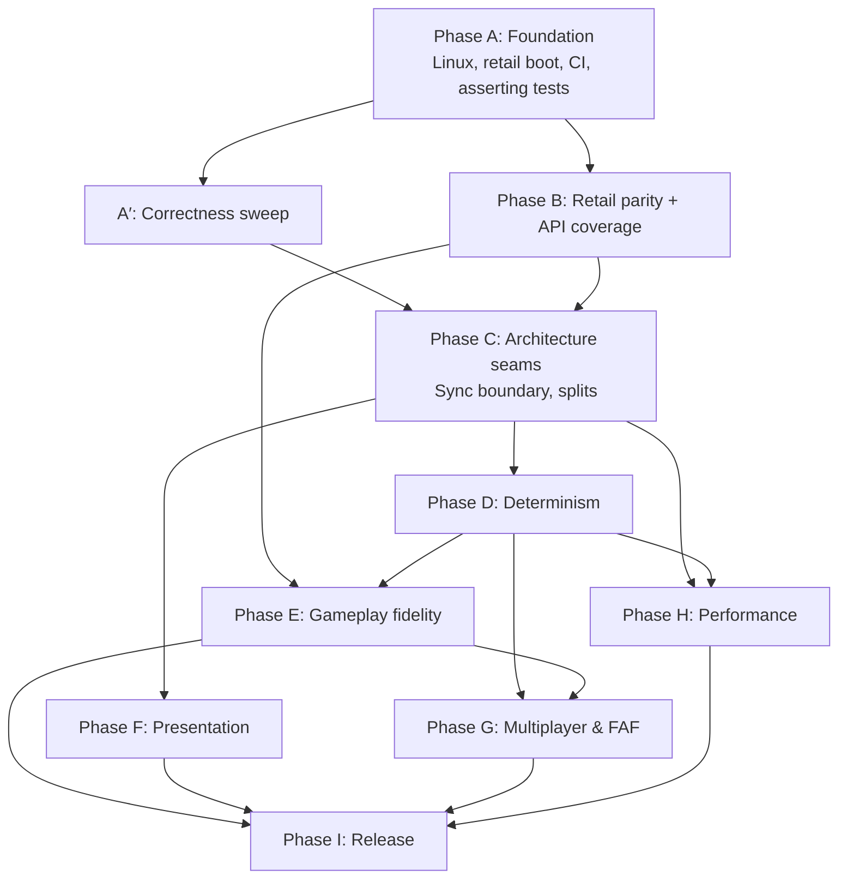

# OpenSupCom Engineering Roadmap

**Status:** living document. Created 2026-09-22 from a code-level audit of `main` at `b91732d`.
**Scope:** everything from "builds on Linux" to "shippable 1.0". The per-milestone
implementation plans live in `docs/superpowers/plans/`. Measured status lives in
`docs/current-state.md`.

---

## 1. Summary

OpenSupCom is broad: about 82k lines of C++20 and 170-odd milestones. It boots FA data,
runs FA's AI through a full skirmish, renders a Vulkan scene, and has a working LAN
lockstep prototype. Until this roadmap it built and ran only on Windows, against a
FAForever install.

The September 2026 audit found that this breadth rests on C++ approximations in exactly
the places that make the game feel like Supreme Commander:

- **Weapons bypass FA's scripts.** `OnFire`, `OnGotTarget` and projectile `OnImpact` never
  run. C++ picks the nearest enemy, and projectile hits are close to guaranteed, with no
  terrain, unit or shield collision.
- **Ground movement is crude.** Units never turn, accelerate or collide, and there are no
  formations.
- **FA's in-game UI never runs.** `gamemain.CreateUI` is not called. The HUD, minimap and
  panels are C++ placeholders.
- **There is no Sim/User boundary.** FA's Sync layer is missing, and the renderer and UI read
  live sim state. That blocks render interpolation, a threaded renderer, and faithful UI
  scripts.
- **Determinism has holes.** Entity iteration order comes from `unordered_map`, the sim RNG is
  not seeded per game, the renderer shares `rand()` with `math.random`, and SimCallbacks mutate
  the sim outside the tick.
- **Verification is weak.** The 210 unit tests pass, but most of the ~100 integration modes
  only log. They return exit code 0 whatever happens, and there is no CI.

The next stage is therefore not about adding features. It is about making what exists
**portable, verifiable and faithful**, in that order, because each step depends on the one
before it.

| Order | Theme | Why it comes here |
|---|---|---|
| 1 | Portable, verifiable foundation (Linux, retail data, CI, tests that assert) | Nothing later can be proven without it |
| 2 | Correctness sweep and architecture seams (Sync boundary, code splits) | Cheap bug fixes, and the seams every later phase builds on |
| 3 | Determinism | Multiplayer and replays are worthless without it; fixing it gets harder the more gameplay exists |
| 4 | Gameplay fidelity (run FA's Lua; movement, collision, weapons) | This is the product |
| 5 | Presentation fidelity (materials, lighting, UI, audio) | Visible quality; depends on the Sync and UI seams |
| 6 | Multiplayer and FAF ecosystem, performance, release | Only worth doing on a faithful, deterministic core |

---

## 2. Where the project stands

Scores run from 0 to 5.

- **Breadth** is how much of the surface exists.
- **Fidelity** is how close it behaves to FA.
- **Verification** is how well automated checks prove it.

| Subsystem | Breadth | Fidelity | Verification | Key evidence |
|---|---|---|---|---|
| Build / platform | 2 | n/a | 1 | Windows-only presets until this roadmap. No CI, no warning flags, no sanitizers. |
| Data / VFS | 3 | 2 | 1 | FAF `init_faf.lua` only. The retail init mounted nothing. Directory lookups were case-sensitive. `find_files` order was unspecified. |
| Lua VM (Lua 5.0 + LuaPlus) | 4 | 3 | 3 | `!=`, `continue` and direct iteration were patched. `#` comments and size hints were missing. `lua_error` longjmps through C++ frames. |
| Sim core / tick | 4 | 3 | 2 | 10 Hz fixed tick with a sensible order. No render interpolation. Full stop-the-world GC every 50 ticks. No SP catch-up cap. |
| Economy / construction / intel | 4 | 3 | 3 | Implemented and unit-tested. Build, reclaim and repair ranges are hardcoded at 5–6 instead of coming from blueprints. |
| Ground movement / pathfinding | 3 | 1 | 1 | Grid A*, but no turning, collision or formations. The throttle drops Move orders, obstacles are never cleared, and there is a patrol loop hazard. |
| Air / naval movement | 3 | 3 | 2 | Air heading, bank and altitude are modelled. Naval draft and dive exist. |
| Weapons / projectiles / shields | 3 | 1 | 1 | FA weapon Lua is bypassed and `OnImpact` is not called. Projectiles have no arc solution and no collision. Shields do not intercept anything. |
| AI | 4 | 2 | 2 | FA's AI runs, but several brain queries are stubs (threat, water ratio, PBM locations). |
| Determinism / netcode | 3 | 2 | 3 | Lockstep, a mux and a lobby are tested headless over TCP, but the sim itself is not order-deterministic across standard libraries. Replay recording is not wired. |
| Renderer | 4 | 2 | 1 | 14 hand-written pipelines with hardcoded sun and water. Confirmed frames-in-flight race. Fog of war does not hide units. No screenshot readback. |
| UI framework (MAUI) | 5 | 4 | 3 | 13 control types. The front end and lobby run FA's Lua. |
| In-game UI | 2 | 1 | 1 | C++ HUD placeholders. `gamemain` is not run and the WorldView control is never rendered. |
| Audio | 3 | 2 | 1 | The UI Lua state has no sound manager, so it is silent. XGS is not parsed. Bank lookup bypasses the VFS. |
| Video | 3 | 2 | 1 | Video probably decodes. No ADX audio. Frame timing follows render rate. |
| Save / load | 0 | 0 | 0 | None. |
| Tests | 3 | n/a | 2 | 210 unit cases pass on Windows, GCC and Clang. Integration modes are log-only. |
| Code health | 2 | n/a | n/a | `moho_bindings.cpp` is 15k lines and `main.cpp` 3.8k. `Unit::update` is about 900 lines. All ten libraries form one dependency cycle. |

### Strengths to preserve

- **The architecture choice is right.** Blueprints stay Lua tables, and the moho class
  pattern with `_c_object` is consistent. A dual Lua VM (sim and UI) mirrors FA.
- **The netcode primitives are well tested:** CommandScheduler, LockstepSession, MuxTransport
  and LanLobby.
- **The MAUI implementation is faithful enough** that FA's front-end Lua runs unmodified.
- **The team writes plans and specs** (`docs/plans`, `docs/superpowers`) and keeps a bug log.
  The culture is good.

---

## 3. Principles

1. **Run FA's Lua; don't reimplement it.** When C++ approximates something FA's scripts do
   (weapon firing, `victory.lua`, `gamemain` UI), the default fix is to make the engine API
   faithful enough that the script runs as written. A C++ reimplementation is the exception,
   and its justification belongs in the milestone spec.
2. **Two data targets, both first-class.** Retail FA 3599 (Steam or GOG) and FAForever. Retail
   is the stable baseline that every developer can own. FAF is the living ecosystem.
3. **Two platforms, one feature set.** Windows (MSVC) and Linux (GCC and Clang) build in CI on
   every PR. macOS stays "portable, untested" until Vulkan via MoltenVK matters.
4. **Prove it or it isn't done.** Every milestone ships with an automated check that fails when
   the feature breaks: a unit test, a data-backed headless test with a real exit code, a
   determinism trace, or a golden image.
5. **Determinism is a tested property**, not a hope. Any sim-touching change must keep the
   two-run checksum trace identical.
6. **Small vertical slices.** One PR per milestone or less, and `main` always green.
7. **Never ship game data.** CI runs only data-free tests. Data-backed tests run where the
   developer owns FA.

## 4. Definition of Done (every milestone)

- [ ] It builds warning-clean on Linux (GCC and Clang) and on Windows (MSVC) in CI.
- [ ] Logic has unit tests. Engine behaviour has a data-backed integration test that asserts
      through its exit code. Visual changes have a golden-image check once M182 lands.
- [ ] The headless retail smoke on SCMP_009 introduces no new Lua errors (error budget).
- [ ] Sim changes keep the two-run checksum trace identical once M196 lands.
- [ ] Code review is done and high-priority findings are fixed.
- [ ] `docs/current-state.md` and this roadmap's status table are updated. Durable decisions go
      to memory.

---

## 5. Phases and milestones

Milestone numbers continue from the existing M1–M174 sequence.

### Phase A — Portable, verifiable foundation (M175–M182) · *done (PR #18)*

**Goal:** Linux is a first-class development and runtime platform. Retail FA data boots.
Every test can be run by a machine. CI guards `main`.

| # | Milestone | Scope | Exit criteria |
|---|---|---|---|
| M175 | Linux build | Ninja/vcpkg presets; GCC and Clang compile fixes; `OSC_SANITIZE`; project warning flags for our code only | ✅ builds on GCC 16 and Clang 22; unit suite green (branch `feat/linux-build`) |
| M176 | Platform layer | New `src/platform/`: XDG and Known-Folder paths, `SIGPIPE` handling plus `MSG_NOSIGNAL`, crash handler (signals + backtrace on POSIX, SEH on Windows). Replaces the `_WIN32` blocks in `main.cpp` and `engine_bindings.cpp`. | Unit tests for path resolution. Deliberate crash test prints a symbolized backtrace. A peer disconnect no longer kills the process. |
| M177 | Game data discovery | Search order: CLI, then env (`OSC_FA_PATH`, `OSC_INIT_FILE`), then Steam libraries (`libraryfolders.vdf` on Linux and Windows, including the Flatpak Steam root), then FAF. Chooses the FAF or retail init. `--print-install` diagnostic. | `opensupcom` with no flags finds Steam FA on this machine. Unit tests parse VDF fixtures. |
| M178 | Retail init and hooks | Glob mounts ✅. Case-insensitive directories ✅. `#` comments and size hints ✅. Hook directories (`hook = {'/schook'}`) applied by `doscript`. Retail `SHGetFolderPath('PERSONAL')` mapping. Retail sim boot to the first tick. | Headless retail SCMP_009 runs 100 ticks with 0 Lua errors. |
| M179 | Lua error unwinding | Compile Lua 5.0 as C++ so `lua_error` unwinds with exceptions and runs C++ destructors. MSVC's SEH did this implicitly; GCC and Clang skip destructors. | ASan build shows no leaks from binding errors. A test proves RAII destructors run on `luaL_error`. |
| M180 | Asserting integration harness | Integration modes return non-zero on failure. `ctest -L data` registration gated on `OSC_FA_PATH`. Smoke report becomes a test output, and the committed `smoke_report.txt` goes away. | 10 or more data-backed tests with real pass/fail, run via ctest. |
| M181 | CI | GitHub Actions: `linux-gcc`, `linux-clang`, `linux-asan` (unit tests), `windows-msvc`. vcpkg binary cache. | CI is green and required on PRs. |
| M182 | Offscreen capture | `--screenshot <png> --frames N` via readback of the scene image. Golden-image compare tool with tolerance. Works on lavapipe. | A golden image of the SCMP_009 opening frame matches within tolerance on this machine. |

### Phase A′ — Correctness sweep (M183) · *done (PR #19)*

These are cheap, high-severity bugs from the audit. They should not wait for their "natural"
phase.

- **Renderer frames-in-flight race:**
  - `set_frame_index` runs after the sub-renderer `update()` calls.
  - The shadow map is single-buffered with no incoming dependency.
  - The render-finished semaphore is per frame instead of per swapchain image.
  - Validation layers are always on.
  - The descriptor pool is fixed at 512 and silently returns `VK_NULL_HANDLE`.
- **Pathfinding:**
  - The throttle leaves the navigator idle, so the Move is popped and silently dropped.
  - Possible patrol infinite loop.
  - `clear_obstacle` is never called, so dead structures block paths forever.
  - The A* failure fallback walks straight through cliffs.
- **Entity lifetime:** C++-side unregisters do not null `_c_object` (projectile impact,
  sacrifice, reclaim), which is a use-after-free from Lua. Crash-impact entities are never
  unregistered.
- **Sim safety:** the single-player accumulator has no catch-up cap (spiral of death), and the
  disabled Lua instruction budget lets an infinite script loop hang the sim.

**Exit:** each bug has a regression test, and ASan shows the unit plus data smoke runs clean.

### Phase B — Retail parity and API coverage (M184–M189) · *in progress*

**Goal:** unmodified retail FA goes front end → lobby → skirmish → score using its own
scripts, windowed, on Linux.

| # | Milestone | Scope |
|---|---|---|
| M184 | Binding-coverage report | Tool that statically scans retail and FAF Lua for engine API use (`moho.*_methods`, globals, `_c_*`) and diffs it against registered bindings. Each entry is classed as real, stub, no-op or missing, with a gameplay-impact tag. Output is a CI artifact plus a ratchet (the count can only go down). ✅ `--binding-coverage`, ratchet test `data.binding_coverage`. Methods are matched by name only, not class. |
| M185 | Retail sim boot tail | `CreatePrefetchSet` and the rest of the retail-only globals, until a 4-AI skirmish runs 10 game-minutes error-free. ✅ **Exit met:** 4 retail AIs play 10 game-minutes on Seton's Clutch with 0 Lua errors, and ASan is clean (`--ai-skirmish --ai-armies 4 --ticks 6000`). What it took: units and weapons are instances of their blueprint script classes (`ScriptModule`/`ScriptClass`, defaulting to `<id>_script.lua`/`TypeClass`); Moho's Kill→OnKilled→Destroy→OnDestroy lifecycle; script handles (entities, manipulators, effects, weapons) that outlive their C++ objects safely; blueprint defaults (Footprint, Intel ranges); full SCM bone lists; reachability-based `CanPathTo`; Moho's `FindPlaceToBuild`; the army pool rules. *Left for follow-ups:* projectile script classes (a death weapon's `PassDamageData` is missing, so `OnKilled` falls back to engine destruction); the threat cutoff in `FindPlaceToBuild`; the C++ initial-resources gift, which is duplicated by the ACU script (harmless, since storage clamps; belongs to M189). |
| M186 | Retail UI boot | Retail `uimain`/`SetupUI` entry semantics (module-relative `import`). Front end and lobby on retail Lua. ✅ Every UI state runs retail `userInit.lua` (globalInit's class conversion, `WaitSeconds`, `FrontEndData`, the Prefetcher). `SetupUI` comes from `import('/lua/ui/uimain.lua')`. UI classes derive from `control_methods` as in Moho. `CurrentTime()` follows a per-frame UI clock. `data.lobby-flow-test` passes on retail (front end → Skirmish → hosted lobby), and all 19 UI modes are in the gate. |
| M187 | FA in-game UI | Call `provider.CreateGameInterface`. Render WorldView controls as UI. Run `gamemain.CreateUI`. Retire the C++ HUD placeholders behind `--legacy-hud`. **M187a ✅** The engine drives retail's game UI the way Moho does. `uimain.StartGameUI` creates the Lua WldUIProvider; the engine keeps it and calls its `StartLoadingDialog` → `CreateGameInterface` (retail `gamemain.CreateUI`, about 230 controls) → `StopLoadingDialog`. The sim → UI **Sync channel** exists: per beat, `Sync` is copied to the user state, then `ResetSyncTable`, `OnSync`, and `gamemain.OnBeat` run; `SetFocusArmy` is a session request applied on the beat. Engine → UI callbacks go to the loaded modules (`OnSelectionChanged`, `OnPause`/`OnResume`, `NoteGameOver`). LuaPlus bitwise operators, the camera API, command sources, avatars and idle lists, and UI-state `categories` were added. UI unit handles resolve by id. `--gameui-test` covers creation, beats, pause, selection, 30 game-seconds of play and game over. *M187b (next):* `--legacy-hud`, rendering WorldView/minimap controls, gating world clicks on UI hit-tests, text layout, a golden re-record. |
| M188 | Audio parity | Sound manager in the UI state. Bank lookup through the VFS with XSB-to-XWB mapping. Music and VO. Listener position. |
| M189 | Script-owned rules | Reconcile the C++ victory and score logic with `victory.lua` and the score threads, which run via hooks. Keep the C++ versions only where the script cannot run. |

### Phase C — Architecture seams (M190–M194)

| # | Milestone | Scope |
|---|---|---|
| M190 | Sim/User boundary | Implement FA's Sync model: `Sync` → `UserSync` each beat, and the renderer and UI read snapshots. Add render interpolation between ticks. This unlocks a threaded renderer and faithful UI. |
| M191 | Split `moho_bindings.cpp` | Split by moho class into `src/lua/bindings/{sim,ui}/`. Break the library cycle: lua↔renderer, core→lua/vfs, sim→blueprints. |
| M192 | Slim `main.cpp` | Move it to `src/app/` (cli, game loop, reload). Move test modes to `tests/integration/`. |
| M193 | Unit command state machine | Turn `Unit::update` into per-command handlers. |
| M194 | Style and tooling | `.clang-format` and `.clang-tidy` (baseline plus ratchet), and a contributor guide. |

### Phase D — Determinism (M195–M199)

| # | Milestone | Scope |
|---|---|---|
| M195 | Ordered iteration | Entity registry iteration in id order. Deterministic Lua-visible lists (`GetListOfUnits`, threat queries, guards). |
| M196 | One sim RNG | `Random()` and sim `math.random` on the seeded `SimRandom` with our own distributions. The renderer gets a separate RNG. Checksum trace tool: per-tick hash with divergence bisection. |
| M197 | FP policy | `-ffp-contract=off` and `/fp:precise`. A portable deterministic implementation of the transcendental functions used in the sim. Pin Lua number formatting. |
| M198 | All mutation in-tick | SimCallbacks travel in the command stream. Peer drop is decided by consensus, not locally. |
| M199 | Replays that work | Record every command source plus the seed, map and options. Add a playback mode. Golden-replay regression tests. Cross-OS lockstep test: a Windows and a Linux build reach the same checksum. |

### Phase E — Gameplay fidelity (M200–M209)

In order of how much they change what the player feels:

| # | Milestone | Scope |
|---|---|---|
| M200 | Weapons through FA Lua | FA weapon classes and callbacks (`OnFire`, `OnGotTarget`, `OnLostTarget`), target priorities, turret yaw and pitch limits, salvos and racks. |
| M201 | Projectiles | Ballistic arc solution. Collision shapes (sphere, box, none) against terrain, units, shields and water. `OnImpact` with impact types. `DamageArea` falloff and rings. |
| M202 | Shields | Bubble interception, overspill, `OnCollisionCheck`. |
| M203 | Ground locomotion | Turn rate, acceleration and braking. Motion follows heading. Unit–unit avoidance and pushing. Footprint occupancy. |
| M204 | Formations | `IssueFormMove` / `IssueFormAttack` / `IssueFormAggressiveMove`, and attack-move semantics. |
| M205 | Pathfinding | Queued throttling. Hierarchical/cluster A*. Seabed layer for amphibious units. `CanPathTo` answers from grid connectivity (done in M185); what remains is making it agree with the hierarchical search. |
| M206 | Order fidelity | Blueprint ranges for build, reclaim and repair. Teleport timing. Nukes and tactical missiles via silo weapons. Ferry. |
| M207 | AI query fidelity | Threat maps with visibility, water ratio, blocking terrain, PBM build locations. |
| M208 | Save/load | Lua state persistence (Pluto supports Lua 5.0) plus C++ sim serialization, wired to FA's save/load UI. |
| M209 | Scenario scripting | `ScenarioFramework`, objectives, and FA campaign operations. Stretch goal. |

### Phase F — Presentation fidelity (M210–M217)

| # | Milestone | Scope |
|---|---|---|
| M210 | Map lighting and sky | Parse the `.scmap` lighting block (sun, ambient, shadow colour, fog), the sky cubemap and water parameters. |
| M211 | Material system | Per-`ShaderName` unit shaders (faction and special), glow and the build shader. A hand port of FA's `.fx` semantics to GLSL, validated against reference captures. |
| M212 | Terrain | Shader variants, the upper stratum, projected decals (albedo, normal, glow, water), runtime scorch and track decals. |
| M213 | Water | Reflection and refraction, map normal maps and ramp, shoreline. |
| M214 | Effects | Emitter ramps and textures, bone-attached emitters, geometric beams and trails, FA explosion emitters, shield impact effects. |
| M215 | Fog of war and icons | Hide entities without intel; blips; FA strategic icon textures. |
| M216 | Media | XGS categories, volumes and RPC curves; sound variations; ADX movie audio; time-based movie playback. |
| M217 | Input | UI-capture-aware world input, terrain raycast picking, FA `commandmode.lua`. Remove the hardcoded keys. HiDPI and Wayland scaling, fullscreen and resolution options. |

### Phase G — Multiplayer and ecosystem (M218–M222)

| # | Milestone | Scope |
|---|---|---|
| M218 | Lobby completeness | Pipelined command delay (RTT-adaptive), slot/faction/team sync, LAN discovery. |
| M219 | Cross-platform play | Windows ↔ Linux play (requires Phase D), with a CI job that runs it. |
| M220 | FAF client compatibility | GPGNet protocol so the FAF client can launch the engine; ICE adapter. |
| M221 | Mods | `__active_mods` hooks, `mod_info`, UI and sim mods, FAF vault content. |
| M222 | Replay container | Replay format and viewer for our engine. Original `.SCFAreplay` playback is an explicit **non-goal**, since it would need bit-exact parity with the closed binary. |

### Phase H — Performance and scale (M223–M226)

**Budgets:**

- Sim tick p99 ≤ 16 ms with 1,500 units (an 8-player late game).
- Render ≥ 144 fps at 1440p in typical scenes.
- Zero allocations in the steady-state tick.

| # | Milestone | Scope |
|---|---|---|
| M223 | Benchmark harness | Deterministic headless benchmark scenario with timing budgets asserted in CI (Release build). |
| M224 | Sim hot paths | Incremental visibility, spatial target acquisition, path caching and reuse, O(1) thread wake, per-tick GC stepping instead of a full collect every 50 ticks. |
| M225 | Threaded renderer | Render thread fed by Sync snapshots (after M190); async pathfinding with deterministic result application. |
| M226 | GPU efficiency | Pipeline cache, bindless or descriptor-indexed textures, GPU-driven instancing for props and units. |

### Phase I — Release engineering (M227–M230)

| # | Milestone | Scope |
|---|---|---|
| M227 | Packaging | Linux AppImage (Flatpak later) and a Windows zip or installer; semantic versioning and a changelog. |
| M228 | First run | Install detection UI, a settings file under XDG or AppData, and a "collect logs" crash bundle. |
| M229 | Steam integration docs | Launching via Steam (launch options, Steam Deck/SteamOS through the Linux build). |
| M230 | 1.0 criteria | Retail and FAF skirmish plus LAN MP on both OSes, all phases' exit tests green, and the performance budgets met. |

**Out of scope until 1.0:** map editor, original-replay compatibility, macOS support,
console or gamepad input.

---

## 6. Dependency graph

Phases C–F can overlap once their inputs land. Gameplay fidelity (E) waits on the
determinism basics (M195–M196) because every E milestone must keep the checksum trace
stable. Starting E before D would mean re-validating all of E later.

---

## 7. Testing strategy

| Layer | What | Where it runs |
|---|---|---|
| Unit | Catch2, no game data; parsers, VFS, Lua patches, netcode, sim rules | Everywhere; CI on GCC, Clang, ASan+UBSan and MSVC |
| Data-backed integration | `opensupcom --<mode>` headless with a real exit code; `ctest -L data`, gated on `OSC_FA_PATH` | Developer machines (no proprietary data in CI) |
| Lua error budget | Every headless run counts Lua errors and warnings; a standard session must stay at its baseline, targeting 0 | Data-backed |
| Determinism | Run a scenario twice (and across processes) and compare per-tick checksum traces; bisect the first divergent tick | Data-backed, plus data-free Lua-less sims in CI |
| Replay regression | Golden replays assert the final checksum and key stats; updating one is a deliberate, reviewed act | Data-backed |
| Golden images | Offscreen capture compared with a tolerance (per-pixel delta and SSIM) | Data-backed; lavapipe or GPU |
| Soak / performance | 30-minute 4-AI skirmish, peak RSS, tick p50/p99 against budget | Nightly on a developer machine; benchmark in CI once M223 lands |
| Fuzzing | libFuzzer targets for `.scmap`, `.scm`, `.sca`, `.dds`, `.xwb`/`.xsb`, since these parse untrusted vault content | Clang CI job (Phase H or earlier) |

**A reference oracle is available.** The real game runs under Proton on the Linux dev machine.
Behaviour and visual questions ("what does FA actually do?") should be settled by capturing
the original, not by guessing. Reference captures are stored with the milestone spec (never
in the repo if they contain game assets).

---

## 8. Risk register

| Risk | Likelihood | Impact | Mitigation |
|---|---|---|---|
| Fidelity ceiling: Moho is closed source, so behaviour is inferred | High | High | Principle 1 (run FA's Lua), the Proton oracle, and FAF community knowledge of engine behaviour |
| Cross-compiler FP determinism is costly | Medium | High | Deterministic math library for sim transcendentals, `-ffp-contract=off`, a cross-OS CI lockstep job; fall back to same-platform-only MP if needed |
| Lua 5.0 stop-the-world GC causes hitches at scale | Medium | Medium | GC stepping per tick with a budget; measure in M223 |
| Retail vs FAF Lua divergence doubles the compatibility work | Medium | Medium | Coverage report per data target; retail is the CI-able baseline |
| Scope creep (campaign, editor) | High | Medium | Explicit out-of-scope list; phase exit criteria |
| Legal: redistributing FA assets | Low | High | Never commit or ship game data; data-backed tests stay local |
| Single maintainer / bus factor | High | Medium | CI, a contributor guide, living docs, the memory log |

---

## 9. Metrics (tracked in `docs/current-state.md`)

- **Tests:** unit tests passing / total, and data-backed integration tests passing / total.
- **Lua errors** in a 600-tick headless retail SCMP_009 session (target 0).
- **Binding coverage:** implemented / referenced engine API, and stubs by impact tier (from
  M184).
- **Determinism:** two-run checksum-trace match (yes/no), and the cross-OS match (from M199).
- **Performance:** benchmark tick p99 in ms; peak RSS.
- **Build:** warnings count, and CI wall time.

---

## 10. Current status

| Phase | State |
|---|---|
| A | **Complete and merged** (PR #18). All of M175–M182 landed. Plan and outcomes: `docs/superpowers/plans/2026-09-22-phase-a-linux-foundation.md`. |
| A′ | In progress alongside B (M183, the strata fix, landed). |
| B | **In progress.** M184–M186 are done (PRs #20, #21 and the M186 branch). The retail gate went from 44 to all 99 data modes, and `retail-gap` is empty; `tests/integration/data_tests.cmake` records each step. Next: M187 (FA in-game UI). |
| C–I | Not started. |

### Findings from the first Linux captures (feed Phases A′ and F)
- ~~**Fog of war** looks wrong around the focus army's ACU~~ Diagnosed with
  A/B captures (M183): the cause was neither fog of war nor shadows. The map's
  second blend texture duplicates the first while strata 5–8 have no
  textures, and those strata painted the black placeholder over the terrain.
  **Fixed**: texture-less strata get no weight.
- **The base stratum renders pale grey-white.** The `.scmap` lighting block
  (sun colour, lighting multiplier, specular) is still ignored. Compare with a
  capture of the original game under Proton before tuning (M210).
- **The initial camera starts at the map centre.** FA starts on the focus
  army's start position (M217).
- **Close-range terrain is blurry.** Per-stratum UV scales and normal-map
  scales need checking against FA (M212).
