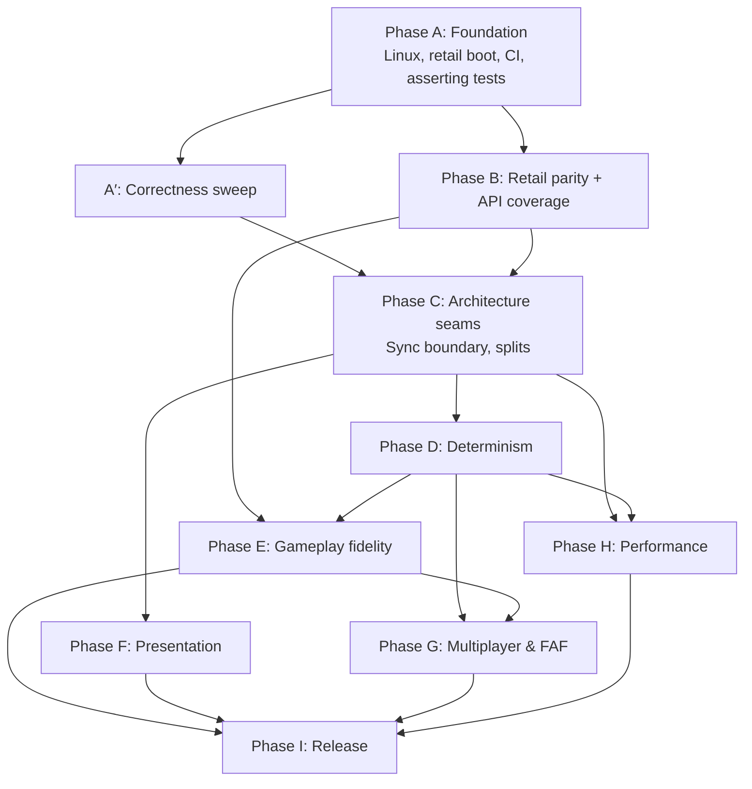

# OpenSupCom Engineering Roadmap

**Status:** living document. Created 2026-09-22 from a code-level audit of `main` at `b91732d`.
**Scope:** everything from "builds on Linux" to "shippable 1.0". The per-milestone
implementation plans live in `docs/superpowers/plans/`. Measured status lives in
`docs/current-state.md`.

---

## 1. Summary

> **Since this summary (2026-09-29):** Phases A–D are done, Phase E is done
> but for the campaign's front end (M209), Phase F is down to a tail, and
> Phases G–I are under way. Retail FA now runs its own scripts end to end:
> front end, lobby (LAN and GPGNet), skirmish and campaign, saves, replays,
> and a game two platforms play in lockstep. §2 has the scores now and at the
> audit; §10 the phases and the agreed priorities. The audit's findings below
> are kept as the record of where this started.

OpenSupCom is broad: about 82k lines of C++20 and 170-odd milestones. It boots FA data,
runs FA's AI through a full skirmish, renders a Vulkan scene, and has a working LAN
lockstep prototype. Until this roadmap it built and ran only on Windows, against a
FAForever install.

The September 2026 audit found that this breadth rests on C++ approximations in exactly
the places that make the game feel like Supreme Commander:

- **Weapons bypass FA's scripts.** `OnFire`, `OnGotTarget` and projectile `OnImpact` never
  run. C++ picks the nearest enemy, and projectile hits are close to guaranteed, with no
  terrain, unit or shield collision.
- **Ground movement is crude.** Units never turn, accelerate or collide, and there are no
  formations.
- **FA's in-game UI never runs.** `gamemain.CreateUI` is not called. The HUD, minimap and
  panels are C++ placeholders.
- **There is no Sim/User boundary.** FA's Sync layer is missing, and the renderer and UI read
  live sim state. That blocks render interpolation, a threaded renderer, and faithful UI
  scripts.
- **Determinism has holes.** Entity iteration order comes from `unordered_map`, the sim RNG is
  not seeded per game, the renderer shares `rand()` with `math.random`, and SimCallbacks mutate
  the sim outside the tick.
- **Verification is weak.** The 210 unit tests pass, but most of the ~100 integration modes
  only log. They return exit code 0 whatever happens, and there is no CI.

The next stage is therefore not about adding features. It is about making what exists
**portable, verifiable and faithful**, in that order, because each step depends on the one
before it.

| Order | Theme | Why it comes here |
|---|---|---|
| 1 | Portable, verifiable foundation (Linux, retail data, CI, tests that assert) | Nothing later can be proven without it |
| 2 | Correctness sweep and architecture seams (Sync boundary, code splits) | Cheap bug fixes, and the seams every later phase builds on |
| 3 | Determinism | Multiplayer and replays are worthless without it; fixing it gets harder the more gameplay exists |
| 4 | Gameplay fidelity (run FA's Lua; movement, collision, weapons) | This is the product |
| 5 | Presentation fidelity (materials, lighting, UI, audio) | Visible quality; depends on the Sync and UI seams |
| 6 | Multiplayer and FAF ecosystem, performance, release | Only worth doing on a faithful, deterministic core |

---

## 2. Where the project stands

Scores run from 0 to 5.

- **Breadth** is how much of the surface exists.
- **Fidelity** is how close it behaves to FA.
- **Verification** is how well automated checks prove it.

### Now (2026-09-29, self-assessed after PRs through #230)

| Subsystem | Breadth | Fidelity | Verification | Key evidence |
|---|---|---|---|---|
| Build / platform | 4 | n/a | 4 | Linux (GCC, Clang) and Windows (MSVC) in CI with -Werror, ASan/UBSan, the clang-tidy ratchet; Windows and Linux play one game in CI. AppImage and Windows zip packaging (M227). |
| Data / VFS | 4 | 4 | 4 | Retail FA 3599 found through Steam; its init, hooks and mods run. The retail gate runs every data mode. FAF data supported but not re-verified here (no FAF install). |
| Lua VM (Lua 5.0 + LuaPlus) | 5 | 4 | 4 | Errors unwind as C++ exceptions; the collector runs on Moho's schedule; the whole heap saves and loads (M208c). |
| Sim core / tick | 5 | 4 | 4 | Render interpolation, ordered iteration, one seeded RNG, all mutation in-tick, per-domain checksums; saves restore the full state. |
| Economy / construction / intel | 4 | 4 | 4 | Retail's scripts drive them (M206); recon as Moho keeps it, including jammers' fake blips. Left: stealth and cloak fields, the underwater sight grid. |
| Ground movement / pathfinding | 4 | 3 | 3 | Moho's locomotion, formations and path costs (M203–M205). Left: spline turns, parked-group footprints. |
| Air / naval movement | 4 | 3 | 3 | Air turning, staging, transports and carriers, naval depth (M206). |
| Weapons / projectiles / shields | 4 | 4 | 4 | FA's weapon scripts fire (M200); collision and shields as Moho's (M201–M202). |
| AI | 4 | 3 | 3 | Retail's AI plays long games error-free; its queries follow Moho (M207). Left: fakes in its threat maps. |
| Determinism / netcode | 5 | 4 | 4 | Lockstep in the live engine, drops by agreement, LAN lobby, GPGNet; a recorded game matches tick for tick across Windows and Linux. |
| Renderer | 4 | 4 | 3 | FA's own shaders ported (lighting, sky, materials, terrain, water, effects, fog, icons). Left: the fidelity variants; M225/M226. |
| UI framework (MAUI) | 5 | 4 | 4 | Every control type; retail's front end, lobby and options run. |
| In-game UI | 4 | 4 | 3 | Retail's `gamemain` UI runs on user-side unit objects (M187, M191). |
| Audio | 4 | 4 | 3 | XACT banks with their variations, VO, pause, duck, fades, Moho's listener and panning, world sounds filtered by sight, streaming (M216). Not yet checked by ear. |
| Video | 3 | 3 | 2 | Movies on their own clock with their XACT sound (M216a). ADX is deferred: no retail movie uses it. |
| Save / load | 4 | 4 | 4 | Full state snapshots, signed per installation, restored in under half a second; a failed restore falls back to replay catch-up (M208c). |
| Tests | 4 | n/a | 4 | 800+ unit cases, ~200 gate data modes on retail, data-free MP pairs, mutation runs; `docs/current-state.md` has the counts. |
| Code health | 3 | n/a | n/a | The executable and the bindings split by phase and class (M191, M192). `renderer.cpp` is next. |

### At the audit (2026-09-22)

| Subsystem | Breadth | Fidelity | Verification | Key evidence |
|---|---|---|---|---|
| Build / platform | 2 | n/a | 1 | Windows-only presets until this roadmap. No CI, no warning flags, no sanitizers. |
| Data / VFS | 3 | 2 | 1 | FAF `init_faf.lua` only. The retail init mounted nothing. Directory lookups were case-sensitive. `find_files` order was unspecified. |
| Lua VM (Lua 5.0 + LuaPlus) | 4 | 3 | 3 | `!=`, `continue` and direct iteration were patched. `#` comments and size hints were missing. `lua_error` longjmps through C++ frames. |
| Sim core / tick | 4 | 3 | 2 | 10 Hz fixed tick with a sensible order. No render interpolation. Full stop-the-world GC every 50 ticks. No SP catch-up cap. |
| Economy / construction / intel | 4 | 3 | 3 | Implemented and unit-tested. Build, reclaim and repair ranges are hardcoded at 5–6 instead of coming from blueprints. |
| Ground movement / pathfinding | 3 | 1 | 1 | Grid A*, but no turning, collision or formations. The throttle drops Move orders, obstacles are never cleared, and there is a patrol loop hazard. |
| Air / naval movement | 3 | 3 | 2 | Air heading, bank and altitude are modelled. Naval draft and dive exist. |
| Weapons / projectiles / shields | 3 | 1 | 1 | FA weapon Lua is bypassed and `OnImpact` is not called. Projectiles have no arc solution and no collision. Shields do not intercept anything. |
| AI | 4 | 2 | 2 | FA's AI runs, but several brain queries are stubs (threat, water ratio, PBM locations). |
| Determinism / netcode | 3 | 2 | 3 | Lockstep, a mux and a lobby are tested headless over TCP, but the sim itself is not order-deterministic across standard libraries. Replay recording is not wired. |
| Renderer | 4 | 2 | 1 | 14 hand-written pipelines with hardcoded sun and water. Confirmed frames-in-flight race. Fog of war does not hide units. No screenshot readback. |
| UI framework (MAUI) | 5 | 4 | 3 | 13 control types. The front end and lobby run FA's Lua. |
| In-game UI | 2 | 1 | 1 | C++ HUD placeholders. `gamemain` is not run and the WorldView control is never rendered. |
| Audio | 3 | 2 | 1 | The UI Lua state has no sound manager, so it is silent. XGS is not parsed. Bank lookup bypasses the VFS. |
| Video | 3 | 2 | 1 | Video probably decodes. No ADX audio. Frame timing follows render rate. |
| Save / load | 0 | 0 | 0 | None. |
| Tests | 3 | n/a | 2 | 210 unit cases pass on Windows, GCC and Clang. Integration modes are log-only. |
| Code health | 2 | n/a | n/a | `moho_bindings.cpp` is 15k lines and `main.cpp` 3.8k. `Unit::update` is about 900 lines. All ten libraries form one dependency cycle. |

### Strengths to preserve

- **The architecture choice is right.** Blueprints stay Lua tables, and the moho class
  pattern with `_c_object` is consistent. A dual Lua VM (sim and UI) mirrors FA.
- **The netcode primitives are well tested:** CommandScheduler, LockstepSession, MuxTransport
  and LanLobby.
- **The MAUI implementation is faithful enough** that FA's front-end Lua runs unmodified.
- **The team writes plans and specs** (`docs/plans`, `docs/superpowers`) and keeps a bug log.
  The culture is good.

---

## 3. Principles

1. **Run FA's Lua; don't reimplement it.** When C++ approximates something FA's scripts do
   (weapon firing, `victory.lua`, `gamemain` UI), the default fix is to make the engine API
   faithful enough that the script runs as written. A C++ reimplementation is the exception,
   and its justification belongs in the milestone spec.
2. **Two data targets, both first-class.** Retail FA 3599 (Steam or GOG) and FAForever. Retail
   is the stable baseline that every developer can own. FAF is the living ecosystem.
3. **Two platforms, one feature set.** Windows (MSVC) and Linux (GCC and Clang) build in CI on
   every PR. macOS stays "portable, untested" until Vulkan via MoltenVK matters.
4. **Prove it or it isn't done.** Every milestone ships with an automated check that fails when
   the feature breaks: a unit test, a data-backed headless test with a real exit code, a
   determinism trace, or a golden image.
5. **Determinism is a tested property**, not a hope. Any sim-touching change must keep the
   two-run checksum trace identical.
6. **Small vertical slices.** One PR per milestone or less, and `main` always green.
7. **Never ship game data.** CI runs only data-free tests. Data-backed tests run where the
   developer owns FA.

## 4. Definition of Done (every milestone)

- [ ] It builds warning-clean on Linux (GCC and Clang) and on Windows (MSVC) in CI.
- [ ] Logic has unit tests. Engine behaviour has a data-backed integration test that asserts
      through its exit code. Visual changes have a golden-image check once M182 lands.
- [ ] The headless retail smoke on SCMP_009 introduces no new Lua errors (error budget).
- [ ] Sim changes keep the two-run checksum trace identical once M196 lands.
- [ ] Code review is done and high-priority findings are fixed.
- [ ] `docs/current-state.md` (metrics: unit tests, gate count, benchmark; known gaps closed and
      found) and this roadmap's status table are updated in the milestone's own PR. Durable
      decisions go to memory.

---

## 5. Phases and milestones

Milestone numbers continue from the existing M1–M174 sequence.

### Phase A — Portable, verifiable foundation (M175–M182) · *done (PR #18)*

**Goal:** Linux is a first-class development and runtime platform. Retail FA data boots.
Every test can be run by a machine. CI guards `main`.

| # | Milestone | Scope | Exit criteria |
|---|---|---|---|
| M175 | Linux build | Ninja/vcpkg presets; GCC and Clang compile fixes; `OSC_SANITIZE`; project warning flags for our code only | ✅ builds on GCC 16 and Clang 22; unit suite green (branch `feat/linux-build`) |
| M176 | Platform layer | New `src/platform/`: XDG and Known-Folder paths, `SIGPIPE` handling plus `MSG_NOSIGNAL`, crash handler (signals + backtrace on POSIX, SEH on Windows). Replaces the `_WIN32` blocks in `main.cpp` and `engine_bindings.cpp`. | Unit tests for path resolution. Deliberate crash test prints a symbolized backtrace. A peer disconnect no longer kills the process. |
| M177 | Game data discovery | Search order: CLI, then env (`OSC_FA_PATH`, `OSC_INIT_FILE`), then Steam libraries (`libraryfolders.vdf` on Linux and Windows, including the Flatpak Steam root), then FAF. Chooses the FAF or retail init. `--print-install` diagnostic. | `opensupcom` with no flags finds Steam FA on this machine. Unit tests parse VDF fixtures. |
| M178 | Retail init and hooks | Glob mounts ✅. Case-insensitive directories ✅. `#` comments and size hints ✅. Hook directories (`hook = {'/schook'}`) applied by `doscript`. Retail `SHGetFolderPath('PERSONAL')` mapping. Retail sim boot to the first tick. | Headless retail SCMP_009 runs 100 ticks with 0 Lua errors. |
| M179 | Lua error unwinding | Compile Lua 5.0 as C++ so `lua_error` unwinds with exceptions and runs C++ destructors. MSVC's SEH did this implicitly; GCC and Clang skip destructors. | ASan build shows no leaks from binding errors. A test proves RAII destructors run on `luaL_error`. |
| M180 | Asserting integration harness | Integration modes return non-zero on failure. `ctest -L data` registration gated on `OSC_FA_PATH`. Smoke report becomes a test output, and the committed `smoke_report.txt` goes away. | 10 or more data-backed tests with real pass/fail, run via ctest. |
| M181 | CI | GitHub Actions: `linux-gcc`, `linux-clang`, `linux-asan` (unit tests), `windows-msvc`. vcpkg binary cache. | CI is green and required on PRs. |
| M182 | Offscreen capture | `--screenshot <png> --frames N` via readback of the scene image. Golden-image compare tool with tolerance. Works on lavapipe. | A golden image of the SCMP_009 opening frame matches within tolerance on this machine. |

### Phase A′ — Correctness sweep (M183) · *done (PR #19)*

These are cheap, high-severity bugs from the audit. They should not wait for their "natural"
phase.

- **Renderer frames-in-flight race:**
  - `set_frame_index` runs after the sub-renderer `update()` calls.
  - The shadow map is single-buffered with no incoming dependency.
  - The render-finished semaphore is per frame instead of per swapchain image.
  - Validation layers are always on.
  - The descriptor pool is fixed at 512 and silently returns `VK_NULL_HANDLE`.
- **Pathfinding:**
  - The throttle leaves the navigator idle, so the Move is popped and silently dropped.
  - Possible patrol infinite loop.
  - `clear_obstacle` is never called, so dead structures block paths forever.
  - The A* failure fallback walks straight through cliffs.
- **Entity lifetime:** C++-side unregisters do not null `_c_object` (projectile impact,
  sacrifice, reclaim), which is a use-after-free from Lua. Crash-impact entities are never
  unregistered.
- **Sim safety:** the single-player accumulator has no catch-up cap (spiral of death), and the
  disabled Lua instruction budget lets an infinite script loop hang the sim.

**Exit:** each bug has a regression test, and ASan shows the unit plus data smoke runs clean.

### Phase B — Retail parity and API coverage (M184–M189) · *done*

**Goal:** unmodified retail FA goes front end → lobby → skirmish → score using its own
scripts, windowed, on Linux.

| # | Milestone | Scope |
|---|---|---|
| M184 | Binding-coverage report | Tool that statically scans retail and FAF Lua for engine API use (`moho.*_methods`, globals, `_c_*`) and diffs it against registered bindings. Each entry is classed as real, stub, no-op or missing, with a gameplay-impact tag. Output is a CI artifact plus a ratchet (the count can only go down). ✅ `--binding-coverage`, ratchet test `data.binding_coverage`. Methods are matched by name only, not class. **Binding tail (2026-09-29):** the campaign's remaining sim calls are bound as Moho has them. `FlushIntelInRect` makes every army forget its blips in a rect (retail's `ClearIntel` after a scripted reveal); the renderer's memory follows. `platoon:UnloadAllAtLocation` and `UseFerryBeacon` order squads Attack to Scout. `brain:PickBestAttackVector` is bound, and `SetUpAttackVectorsToArmy` now builds Moho's grid frontier. `MotorFallDown:Whack` is bound. Squad names match in any case, as Moho's enums do; retail's landing AI asks for `'scout'` and had found no transports. `blip:IsSeenEver` reads the blip's LOSEver, not the explored ground. `--binding-tail-test` (gate). The baseline marks 13 names that retail's engine lacks too, such as the typo `errro` and `SetDamageRadius`. |
| M185 | Retail sim boot tail | `CreatePrefetchSet` and the rest of the retail-only globals, until a 4-AI skirmish runs 10 game-minutes error-free. ✅ **Exit met:** 4 retail AIs play 10 game-minutes on Seton's Clutch with 0 Lua errors, and ASan is clean (`--ai-skirmish --ai-armies 4 --ticks 6000`). What it took: units and weapons are instances of their blueprint script classes (`ScriptModule`/`ScriptClass`, defaulting to `<id>_script.lua`/`TypeClass`); Moho's Kill→OnKilled→Destroy→OnDestroy lifecycle; script handles (entities, manipulators, effects, weapons) that outlive their C++ objects safely; blueprint defaults (Footprint, Intel ranges); full SCM bone lists; reachability-based `CanPathTo`; Moho's `FindPlaceToBuild`; the army pool rules. *Left for follow-ups:* projectile script classes (a death weapon's `PassDamageData` is missing, so `OnKilled` falls back to engine destruction); the threat cutoff in `FindPlaceToBuild`; the C++ initial-resources gift, which is duplicated by the ACU script (harmless, since storage clamps; belongs to M189). |
| M186 | Retail UI boot | Retail `uimain`/`SetupUI` entry semantics (module-relative `import`). Front end and lobby on retail Lua. ✅ Every UI state runs retail `userInit.lua` (globalInit's class conversion, `WaitSeconds`, `FrontEndData`, the Prefetcher). `SetupUI` comes from `import('/lua/ui/uimain.lua')`. UI classes derive from `control_methods` as in Moho. `CurrentTime()` follows a per-frame UI clock. `data.lobby-flow-test` passes on retail (front end → Skirmish → hosted lobby), and all 19 UI modes are in the gate. |
| M187 | FA in-game UI | Call `provider.CreateGameInterface`. Render WorldView controls as UI. Run `gamemain.CreateUI`. Retire the C++ HUD placeholders behind `--legacy-hud`. **M187a ✅** The engine drives retail's game UI the way Moho does. `uimain.StartGameUI` creates the Lua WldUIProvider; the engine keeps it and calls its `StartLoadingDialog` → `CreateGameInterface` (retail `gamemain.CreateUI`, about 230 controls) → `StopLoadingDialog`. The sim → UI **Sync channel** exists: per beat, `Sync` is copied to the user state, then `ResetSyncTable`, `OnSync`, and `gamemain.OnBeat` run; `SetFocusArmy` is a session request applied on the beat. Engine → UI callbacks go to the loaded modules (`OnSelectionChanged`, `OnPause`/`OnResume`, `NoteGameOver`). LuaPlus bitwise operators, the camera API, command sources, avatars and idle lists, and UI-state `categories` were added. UI unit handles resolve by id. `--gameui-test` covers creation, beats, pause, selection, 30 game-seconds of play and game over. **M187b ✅** The C++ HUD placeholders give way to FA's game interface (`--legacy-hud` keeps them). UI rects come from MAUI edges; controls are not clipped to their parents (Moho doesn't; a never-laid-out retail container had hidden the whole control cluster); UI beneath the main WorldView is occluded; the UI draws in Moho's render-pass bands (UnderWorld controls, then world-view content, then the rest). Hit-testing goes by depth, and a press belongs to what was under it when it began (UI or world). Every selection action reaches `gamemain.OnSelectionChanged`. The orders and construction panels work: command and toggle caps come from the blueprint, build options from a real buildable category, UI category filters take blueprint ids. FA's command modes drive world clicks (build placement with snapping, targeted orders incl. reclaim on props) and report `OnCommandIssued`; `ProcessInfo` carries auto mode, repeat build and pause. Intel range rings follow FA's range-overlay filters. FA's minimap window shows the minimap and takes its clicks. Text spaces advance by the font's width. The `scmp009_game_ui` golden (0.1% tolerance) captures the game interface. **M187c ✅** Retail preferences: `Game.prefs` is Lua (as in Moho), held in a private Lua state and saved as sorted Lua source; loading runs it with no globals, so it holds data only. `GetPreference`/`SetPreference` take and return any Lua value by dotted path (copies, as in Moho); `SavePreferences` and `GetOptions` are real. Retail's profiles work: the minimap window's `stratview`, overlay filters, window positions and options persist. The engine creates a "Player" profile when there is none (retail's first-run dialog), replacing a Lua shim that faked one on the front-end path only. An interactive game uses `<config>/opensupcom/Game.prefs`; tests and captures keep preferences in memory, `--prefs PATH` seeds them. A second golden captures the minimap window from a profile fixture. |
| M188 | Audio parity | Sound manager in the UI state. Bank lookup through the VFS with XSB-to-XWB mapping. Music and VO. Listener position. ✅ Design: `docs/plans/2026-09-23-m188-audio-design.md`. **M188a:** FA's XACT data is read as it is. All 80 retail sound banks parse (XACT 3.0, whose layout was worked out from the retail bytes), wave banks resolve by internal name, and `SupCom.xgs` supplies 39 categories and 20 RPC curves. `--audio-data-test` resolves all 1,896 cues. **M188b:** one app-owned cue engine for the whole run (the front end too), playing XACT's rules: track variations, pitch/volume variation, loop counts, RPC curves, category volumes and limits, fades and release curves; the camera is the listener. Retail's audio API works (`PlaySound`/`StopSound`/`WaitFor`/`PlayVoice` duck/`SetVolume`), and retail's own music thread plays and fades its music. **M188c:** unit loops (retail's attached ambient entities) follow their units and end with them; attached entities follow their parent. LodCutoff culls distant one-shots. Damage to the player's units reaches `OnFocusArmyUnitDamaged` (battle music). *Left:* the Moho-exact listener placement and zoom curves need a listening pass; bone offsets for attachments need sim bone transforms. |
| M189 | Script-owned rules | Reconcile the C++ victory and score logic with `victory.lua` and the score threads, which run via hooks. Keep the C++ versions only where the script cannot run. ✅ **M189a:** when `BeginSession` has loaded `victory.lua` (retail and FAF), the scenario's scripts decide the game. `OnDefeat`/`OnVictory`/`OnDraw` post `Sync.GameResult` (retail's result UI), and `EndGame` ends the session: `SessionIsGameOver`, `NoteGameOver`, no pause. `SessionEndGame` (the score screen) stops the sim, and `ExitGame` leaves for the front end. The engine's adjudication stays only as a fallback. Moho's Lua tolerance now covers indexing a boolean (retail's `NoteFocusArmyChanged` reads the `false` entries dead units leave in `UnitData`). **M189b:** army stats have Moho's names and meanings (`Units_History`, `Units_Killed` = losses, `Enemies_*`, value and economy stats, the unit cap), and `GetBlueprintStat` filters by category, so retail's score threads compute real scores. `--victory-test` covers both. *Left:* death weapons need projectile script classes (M201). |

### Phase C — Architecture seams (M190–M194) · *done*

| # | Milestone | Scope |
|---|---|---|
| M190 | Sim/User boundary | Implement FA's Sync model: `Sync` → `UserSync` each beat, and the renderer and UI read snapshots. Add render interpolation between ticks. This unlocks a threaded renderer and faithful UI. Design: `docs/plans/2026-09-23-m190-sim-user-boundary-design.md`. **M190a ✅** The world is drawn between the sim's last two ticks, as Moho draws it. Each tick's poses (and animated bone poses) are captured into a snapshot through a sim tick observer. One `FrameView` per frame interpolates them for every renderer, and for picking, so a model and its overlays agree. Alpha comes from a clock that follows real tick arrivals, so a lockstep stall holds still instead of rocking. `Warp`, `SetPosition(pos, true)`, attaching, boarding a transport and a script-less teleport jump rather than slide, as in Moho; attachments jump with their parent, link by link. `--interp-test` (offscreen, four frames per tick) sees a walking ACU move on 100% of frames; without interpolation it moves on 25%. **M190b ✅** The renderer reads only snapshots. Each tick's records carry everything it draws: kind, army, mesh, health and build state, operation beams, veterancy, cargo, silo ammo, command queues, intel rings, adjacency, shields, effects, army colours and economy, the fog grid and the game result. Death flashes and camera shakes are handed over at the end of each tick, so the renderer no longer changes the sim. Input places the build ghost. `Renderer::render` takes no `SimState`. A new `--render-dump` scene dump was byte-identical before and after the change. *Left:* the UI state's user-unit bindings still read the live sim; that is M191's split into sim and user sides. |
| M191 | Sim/User split | Design: `docs/plans/2026-09-24-m191-sim-user-split-design.md`. **Step 1 ✅** The library cycle is broken: the 34 UI bindings that use the renderer (the camera, `UIWorldView` projection, the selection, `IssueCommand`, ...) moved into `osc_lua_user`, so the sim's Lua library no longer links the renderer. `arch.link_layers` fails on a link cycle, or on the sim, its Lua library or the blueprints depending on a layer above them. **Step 2 ✅** `moho_bindings.cpp` (16k lines) is split by class into `src/lua/bindings/{sim,ui}/`. That's 16 files; the shared helpers, the UI globals and the registration stay (4.2k lines). **Step 3, first slice ✅** An audit of the unit methods retail's UI calls, traced and read. The one that changed the sim, `SetCustomName`, now goes through the command stream as Moho's does. `IsInCategory` takes a category's name, as UserUnit's does.  **Step 3 ✅** The UI's units are Moho's `UserUnit`: `moho.user_unit_methods`, its 36 methods. • They read the tick's `WorldSnapshot`. In a drawn game that is the renderer's capture; otherwise the UI captures the tick the first time it asks. The snapshot now carries the unit settings and economy they report. • They change the unit only through the command stream (`ProcessInfo`, `SetCustomName`). • A UI script no longer sees the sim's methods (`Kill`, `SetHealth` and the rest), and between ticks it sees a unit as the last tick left it. • *Left:* `GetStat` and `CanAttackTarget` read the live unit, read-only, since the snapshot carries no stats or weapons. No retail UI script calls them.  **Step 4 ✅** A fresh UI Lua state for every game and front end, as Moho starts each (design: `docs/plans/2026-09-25-ui-state-per-game-design.md`): • A launch and a return to the lobby tear the old state down and build a new one; the old state's controls get their `OnDestroy` first. • `FrontEndData` keeps deep copies in a state of its own, so the lobby's session config reaches the game. • A second game in a run had broken: retail's `unitviewDetail` reads back a module global it set to nil. It works now, and `data.load_flow` loads from the game menu, returns to the lobby and loads again, with no Lua error. |
| M192 | Split the executable | Design: `docs/plans/2026-09-24-m192-split-executable-design.md`. **Step 1 ✅** The game no longer ships its tests. `main()` is `osc::app::run` in the `osc_app` library (`src/app/`). The ~130 test modes, `integration_tests.cpp` and the LAN harnesses are the integration runner, `osc_integration` (`tests/integration/runner/`), which CTest runs. It reaches the run through `TestModes` hooks placed where the modes stood. The format ratchet now follows moved files.  **Step 2a ✅** `app.cpp` (2.9k lines) is split into `cli.cpp`, `ui_globals.cpp`, `session.cpp`, `reload.cpp` and `frames.cpp`, with a private `app_internal.hpp`, and keeps only `run()`. It is a pure move: a token count finds only 23 `static`s dropped and the new declarations, and a four-AI game's 3,000-tick checksum trace is byte-identical before and after.  **Step 2b ✅** `run()` is an `App` object that owns what the run builds. `run()` reads the command line once, into `Options`. `App`'s phases are its methods: `boot()` (`boot.cpp`), `run_window()` (`window.cpp`) and `run_headless()` (`headless.cpp`). The tests' `Engine` is a view of `App`. It is a scripted move: the token diff shows only the moved declarations and the method frames, and the checksum trace is byte-identical. **Step 2c ✅** The windowed loop is `App::Window`: its frame is named phases (the sim's advance and beats, the scripted flows, the UI frame, input, rendering, the title, and the launch and return-to-lobby handlers) across `window.cpp`, `window_frame.cpp`, `window_session.cpp` and `window_load_flow.cpp`. A verbatim move: the window reaches the App's state through references named as the App names it, a line diff shows only declarations and method frames, and a recorded four-AI game watched in the window gives a byte-identical checksum trace and capture. |
| M193 | Unit order handlers | ✅ `Unit::update` (1,251 lines) is five named phases, and its 22 order kinds are one handler each in `src/sim/unit_orders.cpp`, returning `Next`, `Hold` or `Gone`. Converted by a script that tracks block nesting; four-AI games on four seeds (6,000 ticks, and 18,000 on one) give byte-identical per-domain checksum traces before and after. Design: `docs/plans/2026-09-24-m193-unit-order-handlers-design.md`. |
| M194 | Style and tooling | `.clang-format` and `.clang-tidy` (baseline plus ratchet), and a contributor guide. **✅** `.clang-format` records the existing style and is enforced on changed lines only (`tools/check_format.sh`). `.clang-tidy` checks for bugs and waste, and `tools/clang_tidy_ratchet.py` holds its per-file findings to a triaged baseline (35) that may only go down. CI's clang job runs both, pinned to LLVM 22. The first run found a null dereference when creating a unit from an unknown blueprint, now fixed. `CONTRIBUTING.md` covers the workflow, the checks, the test layers and the engine's less obvious conventions. |

### Phase D — Determinism (M195–M199) · *done*

| # | Milestone | Scope |
|---|---|---|
| M195 | Ordered iteration | Entity registry iteration in id order. Deterministic Lua-visible lists (`GetListOfUnits`, threat queries, guards). **✅** The registry walks entities in id order. Ids only grow, so a new entity is appended to an id-ordered list; a removed one leaves a gap until the end of the tick. Entities created during a walk wait for the next one, and removed ones are skipped. Spatial queries return ids in ascending order. The other order-sensitive walks follow id or name order too: a dying structure's `OnNotAdjacentTo` calls, the enhancement table handed to scripts, and the floating-point sums behind `GetBlueprintStat`. The Lua-visible unit lists, threat queries and guards all build on these, so they follow. *Left:* scripts' own `pairs` over object-keyed tables follows their addresses; the static RNG is M196. |
| M196 | One sim RNG | `Random()` and sim `math.random` on the seeded `SimRandom` with our own distributions. The renderer gets a separate RNG. Checksum trace tool: per-tick hash with divergence bisection. **✅** All sim randomness now comes from the session's `SimRandom`: weapon spread, scripts' `Random` (fixing `Random(n)`, which had returned `n`) and the sim state's `math.random`/`math.randomseed`. It uses our own distributions (53-bit doubles, unbiased integers), pinned by tests. It replaces a static `mt19937{42}` shared across sessions and C `rand()`, which the UI state and particle renderer also drew from. Particles now have their own fixed-seed stream. Each game is seeded: `--seed N`, a fixed seed for tests and captures, a fresh one for interactive play; a multiplayer launch boots with the host's shared seed. Replays record the seed (format version 2; version 1 still loads). The sync checksum covers the RNG state. `--checksum-trace` writes each tick's checksum parts (rng, armies, entities), and `tools/checksum_diff.py` names the first divergent tick and part. `data.determinism` (gate) plays a four-AI game twice as separate processes and requires identical traces for 1,500 ticks. By hand, 3,000 ticks held too. **Checksum domains (2026-09-24):** the checksum covered only RNG, armies' resources and each entity's position and health, so a divergence showed only once it reached those. It is now 11 domains: rng, armies, entities, units, orders, navigation, weapons, projectiles, shields, economy events and script threads. The trace carries each (`tools/checksum_diff.py` names the first that differs), and lockstep peers exchange them, so a desync report says which kind of state diverged. |
| M197 | FP policy | `-ffp-contract=off` and `/fp:precise`. A portable deterministic implementation of the transcendental functions used in the sim. Pin Lua number formatting. **✅** Floating-point contraction is off project-wide (`/fp:precise` on MSVC), and 32-bit builds warn about x87 excess precision. The sim's transcendental functions come from FDLIBM, vendored as a renamed subset in `third_party/fdlibm`: the library Java's `StrictMath` is defined by, whose results depend only on IEEE-754 arithmetic. Sim code calls them through `osc::dmath`, and the Lua math library (`math.sin` … `math.pow`, and `^`) uses them in every state. Numbers become strings through `std::to_chars` (exactly `%.14g`, locale-free) rather than `sprintf`. 70 FDLIBM results are pinned bit for bit, and so is the final checksum of a synthetic game: aircraft and ground units taking random orders from the seeded stream for 600 ticks. CI checks both on GCC, Clang, ASan and MSVC, and MSVC reproduces every bit. |
| M198 | All mutation in-tick | SimCallbacks travel in the command stream. Peer drop is decided by consensus, not locally. **M198a ✅** A UI script's SimCallback is now a command, as in Moho. In single-player it runs at the next tick. Under a lockstep session it is broadcast like an order, and every peer runs it on the same tick. It runs with human input off, so the orders it issues aren't sent a second time. Replays record callbacks (format version 3). Commands and callbacks share one codec (`sim/command_codec`) on the wire and in replays, and a peer's frame is parsed whole before any of it is used. Retail's orders-panel settings were all unbound: `SetPaused`, `SetFireState`, `ToggleFireState`, `ToggleScriptBit`, `SetAutoMode` and `SetAutoSurfaceMode`. They are now the same kind of request, and a unit whose setting changes gets the script hook Moho calls (`OnPaused`, `OnScriptBitSet`, ...). The sync checksum covers those settings. A player's orders are commands too. In single-player a click was applied between ticks and never recorded; now it is scheduled for the next tick, and ids are numbered inside the tick, identically on every peer. The UI's own order calls had become SimCallbacks that retail's scripts have no handler for, so the construction panel's factory builds and upgrades, its enhancements, and the Stop and Dive buttons did nothing. They are now real commands. The factory queue display reads the factory's orders, and `DecreaseBuildCountInQueue` takes orders off inside a tick. Stop also cancels the order under way: an enhancement, or a factory's build, whose half-built unit is destroyed as in Moho. A lockstep frame may carry only its sender's commands. The retail binding baseline had 49 stale entries; it now lists only real gaps, and a closed gap fails the ratchet. **M198b ✅** A dropped peer is decided by agreement. A survivor that times it out stops taking its frames and reports the last one it holds, with the peer's recent frames; a report draws the other survivors' own. Once all have reported, each takes the furthest reported frame as the peer's last, plays any of its frames it missed (relayed in the reports), and releases it from the gate. The engine then defeats the army on the next tick, the same on every survivor, as an engine-source command. Three loopback peers show it: a dying peer's last frame, carrying an order, reaches one survivor only, and both play the order and stay in sync. *Left:* two peers dying at once can still split the survivors' view. The UI state still shares the sim's unit methods, so a UI script could call one directly; M191 splits them. Silo builds from the orders panel waited for silo weapons (done in M206a). Peers are not yet authenticated by the transport (Phase G). **Since fixed:** a player's orders and UI callbacks move only its own army's units, and wire messages are capped at 4 MiB (drop reports trimmed to fit). |
| M199 | Replays that work | Record every command source plus the seed, map and options. Add a playback mode. Golden-replay regression tests. Cross-OS lockstep test: a Windows and a Linux build reach the same checksum. Design: `docs/plans/2026-09-23-m199-replays-design.md`. **M199a ✅** A game's setup is one object (`sim::GameSetup`): the scenario, the seed, which armies play and who plays each, and the options. The command line and the lobby both build one, and the game starts from it. A recording keeps the commands the sim applies, where it applies them, so it covers local, networked and callback commands alike. A dropped player's defeat is now one of those commands. Replays (format version 4) carry the setup, the recording build and the checksum after every tick. `--record <file>` writes one. `--replay <file>` starts the game from the file alone, checks every tick against the recording and names the first divergent tick. `data.replay_roundtrip` (gate) records four AI armies plus a player's scripted orders and unit settings (`--scripted-orders`) for 1,200 ticks, then plays the file back identically. **M199c ✅** CI's Windows job uploads a Release build (`opensupcom-windows`). `tools/cross_os_replay.py` plays the same replay with it under Wine and with the Linux build, on the same retail data. A five-minute four-AI game with scripted player input (3,000 ticks) is identical at every tick between MSVC Release on Windows and GCC Debug on Linux. It runs by hand, since CI has no game data. **M199b ✅** Replays in the game. Retail's replay dialog works: it lists replays through FA's special-file globals (`GetSpecialFiles`, `GetSpecialFileInfo`, `GetSpecialFilePath`, `RemoveSpecialFile`), which keep them per profile in FA's user folder with our own `.oscreplay` extension. `LaunchReplaySession` starts the recorded game from its setup and plays it in the game UI as an observer, with the UI in replay mode. `--watch <file>` does the same from the command line. Every interactive game records, and leaving it writes `LastGame`; `CopyCurrentReplay` saves the game under a name. `data.replay_flow` (gate) takes the dialog's path offscreen and watches a recorded game to its end, matching at every tick. `GetArmyAvatars` now returns nil for an observer, as retail's UI expects. *Left:* lobby slots after an empty one are dropped (a setup counts armies rather than listing them); replay speed controls. |

### Phase E — Gameplay fidelity (M200–M209) · *M200–M208 done; M209 (campaign) in progress*

In order of how much they change what the player feels:

| # | Milestone | Scope |
|---|---|---|
| M200 | Weapons through FA Lua | FA weapon classes and callbacks (`OnFire`, `OnGotTarget`, `OnLostTarget`), target priorities, turret yaw and pitch limits, salvos and racks. Design: `docs/plans/2026-09-23-m200-weapons-design.md`. **M200a ✅** Projectiles are instances of their script classes, however they are made. A projectile's class is resolved as a unit's is (`ScriptModule`/`ScriptClass`, else the script beside its blueprint), falling back to the generic `Projectile`, and cached per blueprint. `OnCreate(inWater)` runs, so retail's `PassDamageData` works and death weapons fire. One resolver serves units and projectiles, and one builder replaces five copies. `weapon:CreateProjectile(muzzle)` fires from the muzzle bone with the weapon's spread, physics and damage. `CreateTrail`, `SetDamage` and `MetaImpact` are bound. `Damage` accepts retail's argument order: every retail call had done nothing. An entity's attached emitters, trails and beams now go with it, where before they leaked. Two older bugs surfaced on the way and are fixed. A stale thread handle could kill whichever new thread took its reused ref, so one commander never died. Particles drew as white squares: no texture, no additive blending, no ramps, seconds read where emitters count ticks, and every emitter looping. **M200b ✅** Weapons fire through retail's state machine. The engine picks targets and runs a tick-counted fire clock (`round(10 / RateOfFire)`). Each weapon script gets `OnGotTarget`, `OnLostTarget` and `OnFire`, gated by Moho's `CanFire`: a target, the weapon enabled, the unit not Busy. Retail's `DefaultProjectileWeapon` fires its own racks, salvos, charges and reloads. Units raise `OnMotionHorzEventChange`, and units under construction hold fire. Unit blueprints get Moho's numeric weapon defaults: retail adds `DamageRadius`, which 228 of its 494 weapons omit. `--weapon-test` (gate) checks state order, shot class, the fire clock, a salvo, a reload, construction and motion events. **M200c ✅** Weapons choose targets as Moho does. `SetTargetingPriorities` compiles its categories when called: Moho copies them, and FAF clears the table it passes. The earliest matching priority wins, then distance, then id; a unit matching no priority is not a target. Targets must be enemies by alliance (team-mates were shot before) and pass `TargetRestrictOnlyAllow`/`Disallow` and `AboveWaterTargetsOnly`. Range is cylindrical, with `MaxHeightDiff` for height; the old 3D distance cut reach against aircraft. Targets are checked every `TargetCheckInterval`, and `AlwaysRecheckTarget` switches to a better priority. An attack order's target comes first. An unsized footprint takes the unit's size: 205 retail units omit it, and the UEF TMD errored. `--targeting-test` (gate). **M200d-1 ✅** Turrets aim. Aim controllers belong to their weapon (fire control by label), turn heading and pitch at their arc speeds within its limits, and gate `CanFire` on `FiringTolerance`. `TrackingRadius` tracks beyond `MaxRadius`, heading arcs filter targets, and the script gets `OnStartTracking`/`OnStopTracking`. A sim pose (the bind pose plus aim, rotator and slider deltas) feeds `GetPosition(bone)`, `GetBoneDirection` and muzzles, so shots leave the turned barrel. The SCM bone reader had the quaternion order and the parent field wrong, so every sim bone transform was off. `--aim-test` (gate). **M200d-2 ✅** The pose renders. Manipulators apply to a unit's bind-pose locals in precedence order: animators set bones, and rotators and aim controllers turn them on top. Skinning matrices and sim bone positions both come from the composed pose, so turrets turn and rotators spin on screen, and animated arms carry their muzzles. Units at rest compute no skeleton. *Left:* Silo, OverCharge and beam weapons still fire from the engine. Countermeasures await projectile targets. Wrecks error until props are script instances (M201). FA's particle size and curve model is Phase F: the commander's warp-in still renders as a white halo. |
| M201 | Projectiles and props | Design: `docs/plans/2026-09-23-m201-projectiles-props-design.md` (slices a-f). **M201a ✅** Props are instances of their script classes: map props (given objects before `BeginSession`), `CreateProp`, `CreatePropHPR`, and new props at a prop's bones (`CreatePropAtBone`, `SplitProp`). Trees fall (`FallDown`/`Whack`) and sink (`SinkAway`); tree groups split into trees; `Kill` goes through the script. Reclaim asks the reclaimer's `GetReclaimCosts`. Area damage passes its direction. Prop blueprints read reclaim strings as numbers. Warp-ins now clear their surroundings as in retail. `prop-test` (gate) covers classes, reclaim values, splitting, felling, `Kill` and reclaim time. **M201b ✅** Units die through their scripts, as in Moho:
- `Kill` makes a unit dead at once: no orders, weapons or economy, and `IsDead`. Its death is counted then.
- Retail's death thread plays the death, makes the wreck (a `Wreckage` prop with the unit's wreck mesh and, after a death animation, its last pose via `TryCopyPose`) and destroys the unit.
- `Destroy` is immediate. Self-destruct and defeat kill through `Kill`.
- Aircraft killed in flight fall and die on landing (`OnImpact`).
- Running out of fuel slows an aircraft (`OnRunOutOfFuel`) rather than crashing it.
- `SetMesh` draws mesh blueprints (wreck, build, enhancement), and wrecks draw burnt.
- The SCM reader had transposed every inverse bind matrix, so every posed unit had been skinned wrong since M52.

`--death-test` (gate). **M201c ✅** Projectile impacts go through their scripts:
- The engine names what a projectile hit, as retail does, and calls `OnImpact`. The script's damage, effects, sound and destruction follow; the engine deals no damage of its own except for shots no weapon passed damage to.
- `GetTerrainType` returns the map's terrain types, which were in every SCMAP and never read.
- Crossing the water's surface raises `OnEnterWater`/`OnExitWater`, and `DestroyOnWater` ends a projectile there.
- Flak bursts at its target's height.
- A homing projectile hears `OnLostTarget`.
- Script entities carry intel, so `VizMarker`s reveal.
- `CreateProjectile`, `CreateProjectileAtBone`, `CreateChildProjectile` and `SetScaleVelocity` take retail's arguments.

`--impact-test` (gate). **M201e ✅** Shots fly the arcs gravity gives them:
- A `LowArc` or `HighArc` weapon solves its launch angle for its target's distance and height at its muzzle velocity.
- Its turret pitches to that angle, and the shell leaves with a real vertical velocity, falling on a parabola integrated exactly.
- Straight weapons aim at their target in three dimensions.
- `LeadTarget` weapons aim where a moving target will be.

`--arc-test` (gate). **M201d ✅** Shots meet what is in their way:
- Each tick's path is swept against units, props and shields (their blueprint boxes, or the shapes scripts set), the ground and the water. The nearest hit that both sides' `OnCollisionCheck` allow wins.
- Friends let shots past, tree groups break up, and wrecks and rocks stop them. Shields stop enemy shots coming in, not those going out.
- Shots aimed where a unit was now miss. `FiringRandomness` scatters over Moho's circle, 12 times narrower than before.
- Expiring shots burst in the air, tracking shots end at their ground target, bombs fall, and script-made projectiles take their blueprint's physics.

`--collide-test` (gate). **M201f ✅** Blasts reach what stands in them, as FAF's Lua copy of `DamageArea` describes Moho's:
- Every unit and prop within the radius, measured in three dimensions, takes the whole amount. Allies and the instigator are spared unless the blast says otherwise, and projectiles are untouched. `DamageRing` spares its inner circle.
- A shield the blast meets from outside takes it, and the units under the shield take only what its `OnGetDamageAbsorption` leaves.
- Area kills are credited to their instigator.

`--area-test` (gate). Ballistic arc solution. Collision shapes (sphere, box, none) against terrain, units, shields and water. `OnImpact` with impact types. `DamageArea` falloff and rings. Projectiles and props become instances of their script classes (blueprint `ScriptModule`/`ScriptClass`; props default to `/lua/sim/Prop.lua` `Prop`; retail trees use `/lua/proptree.lua`, wrecks `/lua/wreckage.lua`). Retail's `CreateWreckageProp` then makes the wrecks, and the engine's own wreck path gives way to it, as victory did in M189. |
| M202 | Shields | Bubble interception, overspill, `OnCollisionCheck`. *Largely delivered by M201:* shots stop at enemy shields and only coming in (M201d), and blasts spend a shield before the units under it (M201f). Beam weapons stop at shields met from outside, through `OnCollisionCheckWeapon` (M206c). *Left:* FAF's overspill between overlapping shields, if FAF's rules are adopted. |
| M203 | Ground locomotion | Turn rate, acceleration and braking. Motion follows heading. Unit–unit avoidance and pushing. Footprint occupancy. Design: `docs/plans/2026-09-24-m203-ground-locomotion-design.md`. **M203a ✅** Ground units drive: • They turn toward their waypoint at `TurnRate` (faster at speed where `TurnRadius` allows), pivot if they have `RotateOnSpot`, and drive along their heading. • They accelerate at `MaxAcceleration` and brake at `MaxBrake` to stop on their goal. • Within `BackUpDistance` they back up, if they can reverse. • `CreateUnitHPR` and `CreateUnit` place units facing the way they're told. • Motion events come from real speed, and turn events fire. • `SetImmobile` holds a unit still, and `GetCurrentMoveLocation` returns its goal. `--drive-test` (gate). **M203b ✅** Ground units keep apart: overlapping units are pushed apart each tick. An idle unit makes way for a moving one, and a unit in a crowd that can't reach its spot counts itself there. `--crowd-test` (gate). **M203c ✅** Units steer around each other, from Moho's `CAiSteeringImpl`. Design: `docs/plans/2026-09-26-m203c-steering-avoidance-design.md`. • A unit on a path looks two seconds ahead for units it would meet. Their boxes are led by their braking distance, and the lower-ranked of the two yields (`IsHigherPriorityThan`: footprint, movement, guard and so on). • It steps aside to overtake a unit ahead going its way, or stops and waits for one crossing or coming head-on. • Two units yielding to each other go in rank order, then by id, where Moho's spline timing tells them apart. • `--steer-test` (gate): crossing Strikers keep 2.1 apart, where they had come within 0.47. • *Left:* footprints for parked groups, Moho's per-node spline turns, and the formation lead in ranking. |
| M204 | Formations | `IssueFormMove` / `IssueFormAttack` / `IssueFormAggressiveMove`, and attack-move semantics. Design: `docs/plans/2026-09-24-m204-formations-design.md`. **M204a ✅** Formation moves: • A group order with a formation is laid out, where the sim applies it, in the slots retail's `formations.lua` returns. They are scaled by the largest footprint + 2 and face the given direction or the way the group travels. Each slot takes the nearest unit of its category, and the group keeps its slowest unit's pace. • `IssueFormMove`/`IssueFormAggressiveMove` take a formation and a facing, and platoons move in their units' formations. • Platoon moves now queue, so AI platoons follow the routes they chose, and `MoveToTarget` heads for its unit. `--formation-test` (gate). |
| M205 | Pathfinding | Queued throttling. Hierarchical/cluster A*. Seabed layer for amphibious units. `CanPathTo` answers from grid connectivity (done in M185); what remains is making it agree with the hierarchical search. Design: `docs/plans/2026-09-24-m205-pathfinding-design.md`. **M205a ✅** Search cost: • A search resolves the mover's passability once and stamps its buffers instead of clearing them. • A heuristic weighted by 1.001 breaks open ground's ties, keeping paths within 0.1% of the shortest. • Cells expanded in the four-AI benchmark fell from 33.2 million to 3.7 million, and the benchmark from 25.2 s to about 19.4 s. |
| M206 | Order fidelity | Blueprint ranges for build, reclaim and repair. Teleport timing. Nukes and tactical missiles via silo weapons. Ferry. Design: `docs/plans/2026-09-24-m206-order-fidelity-design.md`. **M206a ✅** Silo weapons: • Units build missiles for their counted weapons, ordered (`IssueSiloBuildNuke`/`Tactical`, the orders panel) or in auto mode, for the projectile's cost at their build rate, assisted by guarding engineers. • Launch orders fire the right weapon through retail's script, at a unit or the ground, and wait for a missile; a mobile launcher moves into range. • A silo's missile leaves along its muzzle (a nuke rises before it turns), and weapons can hold ground targets.  **M206b ✅** Missile defence: • Projectiles answer category tests (their blueprint's categories, `ALLPROJECTILES`), so retail's collision rules, flares and depth charges work; `ALLUNITS` excludes them. • Weapons with `TargetType = 'RULEWTT_Projectile'` target enemy missiles and torpedoes, at most `DesiredShooterCap` at a time (one anti-nuke per nuke), leading them. • A weapon's `ProjectileLifetime` sets its shots' lifetime.  **M206c ✅** Beam weapons: • A collision beam reaches from its muzzle along its facing, stops at the first thing its weapon may hit, and hits every `CollisionCheckInterval + 1` ticks through `OnImpact`; beam weapons fire through their scripts. • Bones are placed at the blueprint's `UniformScale`: every muzzle had been about 14 times too far from its unit. • A blast reaches what its radius touches, measured to shapes, so a beam or shell on a big unit's hull hurts it. • *Left:* a mobile launcher too close to its target drops the order (M206e); torpedoes from surfaced subs don't dive and dived subs sink only while moving (a naval slice).  **M206d ✅** Charged orders: • Economy events draw their cost through their army's economy, slow with a stall, and report progress to their scripts, so teleports and weapon recharges cost what retail says. • OverCharge fires the OverCharge weapon through its script, which swaps out the main gun and draws 5000 energy. • A teleport holds its queue until the warp; called off, the unit hears `OnFailedTeleport`.  **M206e ✅** Ranges and the queue, from Moho's decompiled unit tasks ([faf-re](https://github.com/Draiget/faf-re)): • **Ranges:** build, repair, reclaim and capture measure a gap: the distance between centres less the worker's footprint and the target's skirt or footprint. It is compared with `MaxBuildDistance` (default 5), or a fixed 5 and 10 for capture. Out of reach, a unit walks just clear of its target first. • **Footprints:** a missing one rounds the blueprint's size up, as Moho does, and props have one. • **Guards:** they help only within reach of the work, and only if they repair or reclaim. • **The queue:** `Issue*` appends, as Moho's does. • **Launch orders:** a launcher too close backs off; with no missile, the order asks the silo for one.  **M206f ✅** Ferries: • A transport's `Ferry` orders are a route that stays queued. It makes a beacon at the first point (its `AI.BeaconName`), shared by transports ordered together. • Units ordered to load at the beacon wait there. The ferry carries them along the route's waypoints to the last point, unloads, and flies back for more. • A beacon goes with the last route that holds it.  **M206g ✅** Specific unloads: `IssueTransportUnloadSpecific(transports, category, position)` picks the cargo in the category when it is given, and the transport drops only those units there; with none aboard, no order is given (Moho's `UNITCOMMAND_TransportUnloadSpecificUnits`). The chosen cargo travels with the order: replays (format v6) and lockstep frames carry it, and the orders checksum domain hashes it.  **M206h ✅** Factory assist, from Moho's guard task (`TryDispatchFactoryOrUpgradeFromGuardQueues`): • A factory guarding a factory takes work from its queue. Each time it is free, the first build order it can build leaves the guarded queue (repeating, it goes to the back) and it builds the unit itself. The one the other factory is building is left alone, even where Moho's rule for a repeating assister would take it: that rule relies on order counts and repeat queues, which aren't here yet. • If the guard order goes mid-build, the unit it was building is dropped, as a factory's is when its build order goes. • `unit:CanBuild` is the sim's check now (`blueprint_can_build`). • *Left:* its own queued builds first, and upgrades.  **M206i ✅** Repeat queues, from Moho's command dispatch: • A factory repeating its queue sends each finished build order to the back and starts the next one the following tick. An order for several units goes back one unit at a time, which builds them in Moho's order. • A build that fails still leaves the queue. • *Left:* while it goes round, the queue shows a split order as two, where Moho shows one with its count.  **M206j ✅** Factory rally orders (Moho's factory command queue): • A factory keeps rally orders apart from its build orders. Each unit it finishes takes them after its roll-off move, and a unit built for a guarded factory takes that factory's. • With none, a factory is given its blueprint's initial rally, 5 ahead of it by default. `GetRallyPoint` returns the first, which retail's roll-off reads. • `IssueFactoryRallyPoint` adds one, and `IssueClearFactoryCommands` clears them. It had been clearing the builds retail's AI queued before setting its rally, so the AI's factories now keep building, and their units gather at its rally markers.  **M206k ✅** Players' rally orders, as Moho's UI gives them: • A move, patrol or transport call splits the selection. Its RALLYPOINT units (factories) take it as a factory command, a flag the order carries through lockstep frames and replays (format v7). The sim puts it in their rally orders, replacing them unless it is queued, and leaves their builds alone. • A right-click on an enemy no longer gives a factory an Attack order, which had cleared its builds. • A selected factory's rally orders are drawn with its orders. • A patrol whose points a unit already stands on no longer spins within one tick: the next leg starts next tick. A path that starts and ends in the same cell no longer spends the tick's path budget, so units parked on their patrol point can't stall everyone else's.  **M206l ✅** Transports carry by their attach points, as Moho's `CAiTransportImpl` does. Design: `docs/plans/2026-09-25-m206l-transport-slots-design.md`. • A transport's bones are sorted by name into class lists. A medium or large unit also holds the 2 or 4 small bones nearest its point. So a UEF T2 transport takes 14 small units, or 6 medium, or 3 large, and mixed loads share the small bones. • Retail transports have no `Class1Capacity`, which the engine had read, so each had carried any number of units of any size. • A carried unit hangs from its bone, by its own `AttachPoint` bone or its centre, facing as the bone does. Scripts hear the real bone's name. Unloaded units are set down where they hung, not on top of each other. • A slot is freed when its unit is unloaded, destroyed aboard or taken off. • The slots are in the checksum. • *Left:* the pickup and the drop (M206m/n).  **M206m ✅** The pickup, as Moho's shared load order (`CUnitLoadUnits` and `CUnitCallTransport`): • Units told to load onto a transport call it. It gives slots to them largest first, and a unit without one is left, its order done (`OnTransportFull`). • The transport flies to the centre of those it took and comes down to its `TransportHoverHeight`. It waits there up to 300 ticks. • Each unit walks under its bone and beams up over 10 ticks, easing from the ground to the bone, then attaches (`OnStartTransportBeamUp` / `OnStopTransportBeamUp`). • A pickup stopped on the way is aborted (`OnTransportAborted`). Its units' orders end, and they don't call it back. • *Left:* the drop (M206n).  **M206n ✅** The drop, as Moho's `CUnitUnloadUnits`: • Over its drop point, a transport comes down to its hover height before setting its cargo down. The unload order now flies: it had dragged aircraft along the ground. • Each unit is set down on the ground where it hung, only if its footprint fits there (Moho's `FitsAt`). Over deep water, nothing is dropped. • Idle, a transport hovers low with cargo aboard and climbs back to its flying height without. • A ferry drops its cargo the same way.  **M206o ✅** Naval depth, from Moho's decompiled `CUnitMotion` and `Projectile`: • A sub dives and surfaces where it stands, as well as on the move. Each tick it goes `DiveSurfaceSpeed`/10 along a sine, down to its `Physics.Elevation` (no deeper than a quarter over the seabed). • Its layer changes when it gets there. Its script hears `OnMotionVertEventChange`: Down, then Bottom; Up, then Top. • A torpedo aims a quarter under the surface, and is held under it only once in the water. So a surfaced sub's torpedoes dive in (`OnEnterWater`), run under, and reach dived subs. A torpedo dropped from above falls.  **M206p ✅** A factory guarding a factory builds its own queued units and upgrades first, as Moho's guard task dispatches its owner's queue before the guarded one's. The first of them runs ahead of the guard order, which carries on once it is done. **M206q ✅** Carriers keep the aircraft they build in storage (`Transport.StorageSlots`, apart from the cargo slots) and launch them when told to unload, from their launch bones: the next tick, then one every 2 ticks (Moho's task timing). Stored units go with the carrier. Every retail carrier had stayed busy for good after its first build, since its script asks `TransportHasAvailableStorage`. Aircraft landing on a carrier, and storage moving with a given carrier, are still to come. **M206r ✅** Air staging, from Moho's `CUnitRefuel` and `ProcessFuelLevels`. Design: `docs/plans/2026-09-26-m206r-air-staging-design.md`. • The orders panel's Dock (`IssueDockCommand`) sends the selection's aircraft to the nearest idle air staging platform. When it can't take them all, they are shared among the platforms within 100 of it, roomiest first. • Retail's AI refuels the same way, with `IssueTransportLoad` onto a platform. • An aircraft takes a slot of its class, flies over the bone, settles onto it facing the bone's way, and docks. • Docked, it refuels at `FuelRechargeRate / FuelUseTime / 10` times the platform's `RefuelingMultiplier` a tick. It repairs at the platform's `RefuelingRepairAmount` a second while its army pays `RepairConsume*` (`OnStartRefueling`). • Full and repaired, it is let go at the platform's next 9-tick look and climbs back to its flying height. • Unloading a platform (the AI's release) sends its aircraft from where they sit to the point. A platform that dies lets them go in the air. • Fuel now burns only in flight. `OnRunOutOfFuel` and `OnGotFuel` fire as the tank reaches and leaves 0. • *Left:* landing on carriers, patrol auto-refuel, the no-platform voice-overs. **M206s ✅** Aircraft land on carriers, from Moho's `CUnitCarrierLand` and `CUnitCarrierRetrieve`. Design: `docs/plans/2026-09-26-m206s-carrier-landing-design.md`. • A carrier reserves storage places round robin over its landing points. Each pass round makes the next aircraft wait 3 ticks more, and a reserved place counts as taken. • Aircraft ordered aboard (`IssueTransportLoad` onto the carrier) come in from 20 back along their place's facing, wait their turn and are stored. The carrier takes its own share of the order: it stops (or surfaces) and waits for them (`OnStartTransportLoading` / `OnStopTransportLoading`). • Docked at a carrier (the Dock button now includes carriers), an aircraft lands and refuels and repairs stored. Full, it is launched from the next launch bone and climbs back to its flying height. • A launched aircraft flies on from the height it left at: it had kept a stale height. • *Left:* a carrier holding its aircraft's height as it moves. • **Aircraft over water** hold their height over the water's surface, not the seabed: Moho's `CUnitMotion` samples max(terrain, water) unless `Air.FlyInWater`. Over water deeper than their `Elevation`, they had flown under the waves. **M206t ✅** Patrol auto-refuel, from Moho's `Unit::FindPlatform` and patrol task: • Every 6 ticks, a patrolling aircraft under a fifth of a tank or three quarters of its health looks for its army's first idle staging platform within that platform's `StagingPlatformScanRadius` (300 by default) with room for it. • It breaks off to refuel and repair there, then patrols on. • With no room when it arrives, it patrols on rather than wait. **M206u ✅** A plain right-click gives each selected unit its default order, as FA does (per its manual's "Giving Orders"): • On an enemy, Attack; Capture for a unit that can capture but not attack. • On an ally, Assist (Guard); Repair for an engineer on one under construction; a load for a unit a transport can carry; Dock for an aircraft at a staging platform. • On a wreck or prop, Reclaim for an engineer. • Units that can't take the order, and every unit on open ground, move there. A mixed selection splits into one order per kind. It had only moved or attacked. • Repairing a unit under construction builds it, as Moho's repair task does: alongside its builder, or alone to completion when it was left unfinished. A unit completes once (`OnStopBeingBuilt`), however many build it. • *Left:* right-clicks on ferry points and on waypoints (patrol, coordinated attack), and a transport right-clicking the units it would carry. **M206v ✅** Units change army by replacement, as Moho's `ChangeUnitArmy` (`Sim::TransferUnit`) does. Design: `docs/plans/2026-09-26-m206v-change-unit-army-design.md`. • A new unit of the new army takes the old one's place: position, facing, layer, an aircraft's height and heading, health and custom name. The old one is destroyed, and its script state (threads, AI manager data, callbacks) goes with it. It is not counted as a loss. • Stored aircraft and carried cargo change army with it and go back aboard. A unit carrying a commander stays as it is (nil); its own army is an error. • Captures go through the script's `OnCaptured` alone: the engine's in-place fallback is gone. The engine's share on defeat gives units through `ChangeUnitArmy` too. • The sim's script classes are imported after `SetupSession`. FAF's `SimUtils` had kept the placeholder `ArmyBrains` made before it, so every FAF transfer (capture, gift, share) silently did nothing. • *Left:* the unit cap (not enforced yet), and animation poses (a new unit's scripts set its pose up again).  **M206w ✅** Script orders, Moho's way. Design: `docs/plans/2026-09-29-m206w-script-orders-design.md`. • A Script order (`UNITCOMMAND_Script`) carries its Lua table, and the unit runs the class its `TaskName` names (`/lua/sim/tasks/<name>.lua`, else `ScriptTask`), as faf-re's `CUnitScriptTask` does. `OnCreate(args)` runs first; then `TaskTick` each tick it asks for, its status read as Moho's task codes; `OnDestroy` runs when the order ends, is cleared or replaced, or the unit dies. `moho.ScriptTask_Methods` gives `GetUnit` and `SetAIResult`. • `IssueScript` works: it had been a no-op, so retail's AI never enhanced its commander. The construction panel's `EnhanceTask` runs as retail's Lua task rather than the engine's own enhancement. The orders panel's ability buttons issue theirs with the clicked point as `Location`, so the Eye of Rhianne scries. • A Script order's table travels in the command stream and replays as `lua_bytes` (replay format 11); `lua_bytes` moved to the sim layer. • Unit tests cover the statuses tick by tick, each way a task ends, the fallback class, errors, endless repeats, `GetUnit`/`SetAIResult` and the codec. `data.script-order-test` runs retail's EnhanceTask through to the upgrade, cancels one (`OnWorkFail`), and has the Eye scry by order and by an ability click. |
| M207 | AI query fidelity | Threat maps with visibility, water ratio, blocking terrain, PBM build locations. **M207a ✅** `brain:GetMapWaterRatio` measures the map as Moho does: heightfield points every 8 units, the border left out, under the water's surface (SCMP_009 is 59% water). It had answered 0, so the AI took every map for land. `FormPlatoon` already matches Moho's: it neither sets `PlatoonHandle` nor calls `OnUnitsAddedToPlatoon`, and it returns a platoon short of a squad's minimum. An earlier note here said otherwise.  **M207b ✅** Influence maps, from Moho's `CInfluenceMap`. Design: `docs/plans/2026-09-25-m207b-influence-map-design.md`. • Each army keeps a grid of threat: cells of max(32, map size / 16), usually 16 × 16. • Every army-count ticks, what its intel detects is reported. That covers every enemy unit it has in sight, radar, sonar or omni, allies' units, and structures it has once seen. It updates every 30 ticks. • A mobile unit out of sight keeps full threat for 10 updates, then loses 0.02 per update. A structure stays until the army sees it gone. • Threat is split, as Moho's is, into land, air, naval, structures, commander, experimental and the Anti lanes. The Anti lanes count only units the army has seen closely. • The brain's threat queries answer from it in cells. `AssignThreatAtPosition` works, and `FindPlaceToBuild` passes over sites with too much AntiSurface threat. • The AI no longer sees through fog.  **M207c ✅** `brain:CheckBlockingTerrain(start, end, arc)`, from Moho's decompiled `CAiBrain` and `CHeightField` ([faf-re](https://github.com/Draiget/faf-re)). It had always answered "clear". • A straight shot (`'none'`) is one segment. A `'low'` or high arc is four chords of a half-sine whose peak is a quarter of the span times 0.5 or 2. • The start is lifted 1 and the end 0.5. • Each chord is cast against the heightfield as Moho casts it: each cell is two triangles, split along its diagonal. • Retail's naval `CheckNavalPathing` passes an end it never set, which reads as the map's origin, as Moho's does. • PBM build locations needed nothing: retail's `aibrain.lua` defines every `PBM*` method in Lua, over the engine's. • *Left:* jammers' false blips (no jammer makes them yet). |
| M208 | Save/load | Design: `docs/plans/2026-09-25-m208-save-load-design.md`. A save is the game's recording (setup and commands), plus the orders still to run. **M208a done:** loading replays the recording to the saved tick, checked against its checksum trail, then hands over to the player. That is correct by construction, since replays play back identically. Retail's `InternalSaveGame` and `LoadSavedGame` are bound, and the load catches up in the game's frame loop. `data.save_load` and `data.load_flow` hold it. **M208b ✅ measured:** a load costs what the game took to play. A 30-minute four-AI game loads in 6 minutes and a 60-minute one in about 40 (Release, before M224's sim speedups). So loads speed up with the sim (M224), and long games need M208c: state snapshots (Pluto for Lua 5.0 plus C++ serializers), a milestone of its own. Loading from inside a game works since M191 step 4 (a fresh UI state per game) and #94 (the relaunch renderer fixes). **M208c** State snapshots (design: `docs/plans/2026-09-29-m208c-state-snapshots-design.md`). **M208c-a ✅** Lua persistence (`lpersist.cpp`): • It writes what the collector's mark reaches, weakly held objects included, and loads it into another state. • Value-keyed tables keep their exact layout, so they iterate as they did. • Threads keep their call frames, and open upvalues stay open. • C functions are written as offsets in the binary, and light userdata go through the sim's hooks. • Frozen tables and the collector's modes are kept. From tick 1 the sim collects only on its 70-tick schedule. Lua's own threshold follows a byte count that differs between builds, runs and restored heaps. The sim's whole heap round-trips in `--persist-test`: 33 MB 300 ticks in, 0.6 s to save and 0.1 s to load in Debug. **M208c-b ✅** The C++ sim. • Serializers for all 59 of the sim's types (`state_io*.cpp`), with a check that no field is forgotten (`arch.state_io`). • Pointer translation between Lua and C++. • Saves carry the snapshot, zlib-compressed: 12 MB at tick 18000, written in 0.7 s. • Headless `--load` restores it in 0.25 s, checked against the history's checksum. Games restored at ticks 70 to 17000, and the campaign, play on identically to the saved game (`data.save_load`, `data.save_load_replay`, `data.save_load_campaign`). **M208c-c ✅** The game's own loads. • The Load dialog's relaunch restores too: about 0.4 s in Debug. • A failed restore reboots the game and catches up. • Snapshots are signed per installation (HMAC-SHA256, a key in the user folder). Only its own are restored; a save from anyone else catches up, since a snapshot names C functions by address. `data.load_flow` restores, and falls back on a damaged snapshot. `data.save_load` also loads as another installation, which catches up to the same game. |
| M209 | Scenario scripting | `ScenarioFramework`, objectives, and FA campaign operations. Design: `docs/plans/2026-09-29-m209-campaign-design.md`. **M209a ✅** An operation launches as retail's `SetupCampaignSession` does (`--map` a campaign scenario: army 1 the player's, the rest the operation's AI, the campaign options, `--difficulty`). Its scripts' engine API is in: `GenerateArmyStart`, `SetAllianceOneWay`, `SetIgnorePlayableRect`, 0-based `SetArmyFactionIndex`, platoon templates by blueprint id, Rect queries by field, persistent `Blip.lua` blips with `OnDetectedBy`/`OnDestroy`, `GetCollisionExtents`, strategic underlays, `GetMovieDuration`, `SyncPlayableRect`. X1CA_001 plays past its faction pick; X1CA_001-003 run headless. `--campaign-test` (gate). *Left:* per-tick economy rates (a skirmish-wide fix), blip lifetime (Phase F), the playable-area boundary, the economy overlay, and the campaign's front end (operation select, briefings, progress). |

### Phase F — Presentation fidelity (M210–M217) · *mostly done; a tail remains (§10)*

| # | Milestone | Scope |
|---|---|---|
| M210 | Map lighting and sky | Parse the `.scmap` lighting block (sun, ambient, shadow colour, fog), the sky cubemap and water parameters. **M210a ✅** The map's lighting, from FA's `terrain.fx` and `mesh.fx`. Design: `docs/plans/2026-09-26-m210a-map-lighting-design.md`. • The parser reads the terrain shader, the sky and environment cubemaps, the 23 lighting floats and the water block. • Terrain and meshes light as FA's shaders do: the map's sun and colour, ambience, shadow fill and multiplier, and each terrain shader's specular (`TTerrain`, `TTerrainXP`). The shadow map looks down the map's sun. • The engine's invented haze, fill light and hemisphere ambient are gone: no FA shader fogs. • FA's formula exposed three renderer bugs, now fixed. Stratum normal maps were decoded as DXT5nm, where FA reads RGB, so the terrain barely took the sun. The strata textures were bound before they had loaded, so the terrain drew white all game. With bloom off, the composite pass read an unwritten image. • `--lighting-test` (gate) checks two maps' data and renders one view under several lights; flat ground's light matches the formula to 0.01. • *Left then:* the sky dome (M210b), the map's water lighting (M213), bloom from the map's value (M211e), mesh specular (M211) and stratum masks and the upper stratum (M212).  **M210b ✅** The map's sky dome, as Moho's `SkyDome` draws it with `sky.fx`. Design: `docs/plans/2026-09-28-m210b-sky-dome-design.md`. • The parser reads each map's sky block (and the cartographic batches after it) instead of skipping a fixed size: the dome's shape, the horizon and sky colours, the sky decals, and the four cirrus layers. A map older than version 58 gets `SetupHorizonAndCirrus`'s sky. • First in the scene pass, before the terrain: &nbsp;&nbsp;– the Atmosphere pass grades the horizon's colour into the sky's through retail's `horizonLookup` (A8, which the DDS parser now reads); &nbsp;&nbsp;– the decals' billboards draw their albedo, then their glow into alpha for the bloom; &nbsp;&nbsp;– the cirrus drifts by the tick. • No depth test. Clockwise triangles are culled, so the dome shows from inside it; above it, the frame is Moho's black clear, which replaces the old blue-grey. • `--sky-test` (gate): &nbsp;&nbsp;– SCMP_009's block matches the file, and all 5182 props still read after it; &nbsp;&nbsp;– a column of sky pixels matches `AtmospherePS` at each ray's point on the dome (64 of 64, the worst error 0.0005); &nbsp;&nbsp;– from above, every pixel over the dome is black; &nbsp;&nbsp;– a decal draws and glows; &nbsp;&nbsp;– the cirrus draws and drifts. • *Left:* the cumulus, which Moho hands no clouds. |
| M211 | Material system | Per-`ShaderName` unit shaders (faction and special), glow and the build shader. A hand port of FA's `.fx` semantics to GLSL, validated against reference captures. **M211a ✅** Meshes shade as FA's `NormalMappedPS`. Design: `docs/plans/2026-09-27-m211a-unit-material-design.md`. • Team colour by the SpecTeam alpha, environment reflection (`2·env·spec.r`), the highlight (`spec.g`) and glow (`2·spec.b`), by FA's constants. • The map's `<default>` environment cube, as Moho looks it up: DDS cubemaps now load. • Props skip the team mask. • `--material-test` (gate). • *Left:* the faction techniques (Aeon, Insect, Seraphim, Metal), `WreckagePS`, the build shaders.  **M211b ✅** The factions' materials. Design: `docs/plans/2026-09-27-m211b-faction-materials-design.md`. • Each mesh draws with its blueprint's technique: `Aeon` (its own `<aeon>` cube and highlight, the sun at 0.6), `Insect` (Cybran: a lookup highlight kept off the team colour, the sun twice over) and `Metal`. • The light set carries the `<aeon>` and `<seraphim>` cubes and FA's two lookup textures. • *Left:* Seraphim's falloff and the CZAR (M211c), `WreckagePS`, the build shaders.  **M211c ✅** Seraphim's falloff, and FA's alpha rules. Design: `docs/plans/2026-09-27-m211c-seraphim-material-design.md`. • `UnitFalloffPS`: the mesh's `LookupName`, point-sampled by how squarely the surface faces the eye, at its army's row (`GameColors`); no sun, no team tint. • Only props alpha-test (over `0x80`); a unit's albedo alpha is a mask. Seraphim units had mostly been discarded. • *Left:* `AeonCZAR`, `WreckagePS`, the build shaders; glow into bloom (M211e).  **M211d ✅** Wrecks shade as FA's `WreckagePS`. Design: `docs/plans/2026-09-27-m211d-wreckage-material-design.md`. • The crunch noise (`wreckage_noise.dds`) tiled 5.15 times, offset by the tick the wreck's mesh instance was made; no shadow. • `WreckageVS`'s crumple. • *Left:* `AeonCZAR`, the build shaders; glow into bloom (M211e).  **M211e ✅** FA's bloom, from the glow in the frame's alpha. Design: `docs/plans/2026-09-27-m211e-glow-bloom-design.md`. • Units write their SpecTeam blue (plus 0.01) to alpha, TTerrain its specular; the rest leave it. • FA's copy, 7-tap blur (×1.5, twice) and sum, at half size, by the map's `Bloom`. • Units under construction blend with a pipeline of their own, and don't glow. • *Left:* `AeonCZAR`, the build shaders; decals' and particles' glow.  **M211f ✅** Units under construction draw with FA's build shaders. Design: `docs/plans/2026-09-27-m211f-build-shaders-design.md`. • Retail's scripts already put a unit under construction into its `_build` mesh; its `UEFBuild`, `AeonBuild`, `CybranBuild` or `SeraphimBuild` technique now draws it, fed the fraction complete, the instance's age and FA's time, with the LOD's `SecondaryName`. • UEF pulses blue under a scrolling overlay; Aeon grows from 75% under a sheen, opaque, casting no shadow; Cybran fades in from 40% under red lines; Seraphim grows from a quarter through a distortion, its shadow too. The team's colour fades in over the last tenth. • A build technique's overlay is a second pass; UEF's and Cybran's blend alpha too, so they glow. • The engine's generic fade is gone: Moho has none. • `--build-shader-test` (gate). • *Left:* hidden bones (`HideBone`: UEF structures start hidden, ACUs' enhancements); the build effects' meshes (`UEFBuildCube`, `AeonBuildPuddle`); `AeonCZAR`.  **M211g ✅** The build effects' meshes, Moho's shader names, and burnt trees. Design: `docs/plans/2026-09-27-m211g-effect-meshes-design.md`. • ShaderNames resolve through Moho's dictionary of legacy names (`TMeshGlow` is `NormalMappedGlow`, `TMeshAlpha` `NormalMappedAlpha`, …). • UEF's build cube (`UEFBuildCube`: unlit, pulsing, writing no depth), its slices (`AlphaFade`) and Aeon's pool (`AeonBuildPuddle`) draw as FA's; `NormalMappedGlow` and `NormalMappedAlpha` tint by the instance's colour, which is white for every mesh but a unit's. • Burnt trees (`BlackenedNormalMappedAlpha`) grey their albedo and are alpha-tested; M211d had sent them down the wreck path, and they drew black. • `--effect-mesh-test` (gate). • *Left:* the props' `VertexNormal`, `NormalMappedTerrain` and `UndulatingNormalMappedAlpha`; shields and the other effect techniques; `DepthClip`; hidden bones (M211h); what burns trees near SCMP_009's first base.  **M211h ✅** FA's rigid skinning, and hidden bones. Design: `docs/plans/2026-09-27-m211h-bones-design.md`. • A vertex follows its first bone alone, as FA's vertex shaders do. The engine blended its four named bones a quarter each, and half of retail's vertices name a bone and three zeros: animated parts moved a quarter as far as they should. • `Unit:HideBone` hides in the renderer: a hidden bone is parked out of sight, as Moho's `HardwareMeshBatch` parks it, shadow and all. The UEF commander's upgrades stay hidden until built, a UEF structure until its build cube has risen. • `--skinning-test` (gate). • *Left:* the props' other techniques, shields, `DepthClip`. (The burnt trees near SCMP_009's first base are FA's own: each commander's warp-in fells the trees about it.)  **M211i ✅** The props' materials. Design: `docs/plans/2026-09-27-m211i-prop-materials-design.md`. • `VertexNormal` (rocks, pipes: lit by the vertex's normal, blended, tested over `0x23`), `NormalMappedTerrain` (clutter: unshadowed, no highlight) and `UndulatingNormalMappedAlpha` (trees, swaying in FA's wind), 313 of retail's blueprints between them. • `--prop-material-test` (gate). • *Left:* `DepthClip` shadows; `Clutter` and the rest; shields and the other effect techniques.  **M211j ✅** Shadows cut by their albedo's alpha. Design: `docs/plans/2026-09-27-m211j-clipped-shadows-design.md`. • FA's `DepthClip` (`clip(albedo.a - 0.5)`) for `NormalMappedAlpha`, burnt trees, `VertexNormal` and props of unported techniques; `UndulatingDepthClip` for the swaying trees, whose shadows sway too. Forests cast trees' shadows, no longer the cards' they're painted on. • `--clipped-shadow-test` (gate). • *Left:* `Clutter` and the other props' techniques; shields and the other effect techniques (`Flat`, `Effect` also clip).  **M211k ✅** FA's shields. Design: `docs/plans/2026-09-28-m211k-shields-design.md`. • A shield draws as its blueprint's mesh, with mesh.fx's `ShieldUEF`, `ShieldCybran`, `ShieldAeon` and `ShieldSeraphim`. Its depth fill (`ShieldFill`) draws just before it and hides its far side. Each hit adds an impact patch (`ShieldImpact`, `CybranShieldImpact`) facing the shot. The circle outline the overlay drew is gone. • Shields draw last among the meshes, after the effects above the water (Moho's POSTWATER + POSTEFFECT stage), in their SortOrder: impacts, fill, shield. Their colour follows their health (PARAM_FRACTIONHEALTH), and they cast no shadow. • Any entity with a mesh draws now: shields, and script entities given one. An enemy's shows where the player sees. • An attached entity sits where Moho puts it: its parent bone's transform (a unit's bone -1 is its centre, half its height up), then its parent offset. A shield is centred there, and so is its collision sphere. • `--shield-render-test` (gate) replaces M107's. • *Left:* the personal shields (`PhaseShield`, `SeraphimPersonalShield`: M211l); the low fidelity variants; `Clutter` and the other effect techniques.  **M211l ✅** FA's personal shields. Design: `docs/plans/2026-09-28-m211l-personal-shields-design.md`. • A personal shield swaps its owner's mesh for `OwnerShieldMesh`. The swapped mesh draws as mesh.fx's `PhaseShield` (the ACUs, the UEF and Aeon SCUs, the Obsidian) or `SeraphimPersonalShield` (the Seraphim SCU): the unit by its Unit or Seraphim technique, then a translucent electric shell 0.05 out along its normals. • The shell is blended with its depth written, drawn with the unit before the water, and reflected. • `--shield-render-test` Test 5 (gate). • *Left:* the low fidelity variants; `Clutter` and the other effect techniques. |
| M212 | Terrain | Shader variants, the upper stratum, projected decals (albedo, normal, glow, water), runtime scorch and track decals. **M212a ✅** The strata blend as FA's `terrain.fx` blends them. Design: `docs/plans/2026-09-26-m212a-terrain-strata-design.md`. • Albedo masks are sharpened (`saturate(mask·2−1)`): a stratum under half its mask adds nothing. Normals blend by the raw mask. • `TTerrain` maps blend four strata, `TTerrainXP` maps eight. • The upper stratum lies over the rest by its alpha. • Normal maps repeat at their own size. The sizes moved to a uniform buffer: the push block had outgrown Vulkan's guaranteed 128 bytes. • SCMP_009 and SCMP_010 now match FA's own previews of them. • `--strata-test` (gate) draws a terrain of its own and checks each rule. • *Left:* projected decals and their lighting, runtime decals, the water ramp over submerged terrain (M213).  **M212b ✅** The map's decals, projected and lit. Design: `docs/plans/2026-09-28-m212b-lit-decals-design.md`. • A decal is placed by its corner, as Moho places it: the engine had centred every one, half its size off. Normal decals bake the same way. • It draws the terrain's own triangles under its footprint, projected by its texture matrix (`CWldTerrainDecal::Update`), with FA's depth bias. The flat quads that floated over slopes are gone. • Lit by the terrain's formula, through one GLSL block the terrain shares: `DecalsPS` (the specular's red) for Albedo, `DecalAlbedoXP` (its alpha) for AlbedoXP. It takes the terrain's normal, shadow, water tint and fog of war. Alpha is the albedo's times retail's `decalMask.dds`, faded by the camera's LOD metric (`GetLODAlpha`). • Decals are kept by type. Alpha Normals join the normal decals, and the water and glow types no longer draw as albedo (M212c draws them). • `--decal-render-test` (gate). • *Left (M212c):* the glow, glow mask, water albedo and water mask decals; runtime splats and scorch marks; decal fidelity.  **M212c ✅** Scripts' decals and splats: tarmacs, scorch marks, beam burns, tread marks, resource markers. Design: `docs/plans/2026-09-28-m212c-runtime-decals-design.md`. • `CreateDecal`, `CreateSplat` and `CreateSplatOnBone` take faf-re's arguments and place a decal about its transform (`CreateDecalFromTransform`): the corner is the centre less half of each side, the turn −h. A splat on a bone takes the bone's world transform, its offset turned by it. The splats return nothing, as Moho's do. • Their lifetime is in ticks (`floor(duration·10)`), and who sees them follows `CDecalBuffer`. A splat from a non-civilian army is seen by all. A decal is seen by its allies and by an army that detects its bounds, at creation or on that army's turn (one a tick). A seen flag is never cleared. • The renderer's `RuntimeDecals` is Moho's user-side `CDecalManager`. It adds what the focus army sees and removes what it no longer does, and a removal fades 0.2 a beat (a decal) or 0.03 (a splat). • Albedo and AlbedoXP decals draw in the map's decal passes. Splats (`TSplats`) are quads on their corners at the terrain's height, lit with no specular, faded by the LOD metric at their first corner, 2500 at most a frame, with a depth bias of −0.001. • The commander's warp-in scorch and the mass and hydrocarbon markers now show; the SCMP_009 golden images were re-recorded for them. • `--runtime-decal-test` (gate); `--decalsplat-test` and `--emitter-test` now check Moho's behaviour. • *Left (M212d):* Alpha Normals (tarmacs, nuke scorch) re-baked into the normal overlay as they come and go; the Glow and Glow Mask decals; the water decals.  **M212d ✅** Glowing decals and glow masks. Design: `docs/plans/2026-09-28-m212d-decal-glow-design.md`. • The decal passes run in `HighFidelityTerrain::DrawNormals`'s order: glow masks, Albedo, AlbedoXP, the splats, then the glowing decals, for the map's decals and the scripts' alike. • Glow (`TDecalsGlow`) adds `albedo.a × mask × 0.25` into the frame's glow, which the bloom reads. Glow Mask (`TDecalGlowMask`) draws lit colour without shadows where its alpha reaches 0.9, and sets the glow there to 0.01. • `Renderer::request_scene_capture` reads the scene back before the bloom, the glow in alpha, for tests. • `--decal-render-test` and `--runtime-decal-test` check both, and the order. • *Left (M212e):* runtime Normals and Alpha Normals decals (a GPU-drawn normal overlay); the water decals; animated decal textures.  **M212e ✅** Moho's terrain normals. Design: `docs/plans/2026-09-28-m212e-terrain-normals-design.md`. • A normal pass before the scene draws the terrain's normals into a target, as `DrawTerrainNormal` does: the strata's tangent normal in RG, and the map's own normal maps in BA, a texel a world unit, sampled with a cubic B-spline. The normal decals then blend into RG, the map's and the scripts' alike: each turned by its `TangentMatrix`, blended by its texture's red, masked and faded. • The terrain, the decals, the glow masks and the splats read their own pixel of it, composed as frame.fx's `BasisPS` does. The engine's per-pixel basis, from the mesh's vertex normals, and the CPU-baked decal overlay are gone. • The scmap parser reads the normal maps (SCMP_009: one 1024² tile); a terrain without any gets one made from its heights. • Scripts' Normals and Alpha Normals decals draw now: a tarmac's normals, and the nuke's scorch (the commander's warp-in crater shows its rim). • `--terrain-normal-render-test` (gate): SCMP_009's normal map agrees with its heights (x in alpha, z in green); a slope, a stratum, a normal decal turned and half-blended, a script's fading Alpha Normals decal, and a splat over a normal decal each light as FA's formula gives. • *Left:* `TTerrainGlow` (lava maps), the water decals, animated decal textures, the medium and low fidelity terrains.  **M212f ✅** `TTerrainGlow`, Varga Pass's lava. Design: `docs/plans/2026-09-28-m212f-terrain-glow-design.md`. • The one retail map drawn with terrain.fx's `TTerrainGlow` (SCMP_023) had drawn as `TTerrain`. Now its lava stratum scrolls by 0.01 of (sin, cos) of Time / 8, and the stratum's alpha, sampled at the offset swapped, is the frame's glow by its mask. So the lava glows through bloom. • The terrain's Time is the tick and interpolant, set only when Moho's terrain re-tessellates: when the camera moved (bit for bit) or the decals changed. So the lava stands still under a still camera, as in FA. • `--terrain-glow-test` (gate, on Varga Pass), and unit tests. • *Left:* the water decals, animated decal textures, the medium and low fidelity terrains. |
| M213 | Water | Reflection and refraction, map normal maps and ramp, shoreline.  **M213a ✅** FA's water surface. Design: `docs/plans/2026-09-27-m213a-water-design.md`. • The water is one quad over the map at its elevation, shaded as water2.fx's `HighFidelityPS`: four wave normal layers scrolling by the map's movement and repeat rates, the frame drawn so far refracted through them, the sky cube reflected, by the map's water colour, colour lerp, Fresnel bias and power, sun shininess and reflection. The engine's invented sine-wave grid is gone. • The water map (Moho's `RebuildWaterMapRect`): the map's flatness and foam masks, which the parser now reads, the depth to the abyss, and where land rises out of it. A Fresnel table by depth and incidence (`BuildFresnelLookupTexture`). • The scene pass splits around the water, as `CWorldView` draws it: the alpha mask (`TWaterLayAlphaMask`), a copy of the frame, then the surface. Effects with a negative `SortOrder` draw before the copy. • Under the water the terrain takes the map's water ramp by depth (terrain.fx's `ApplyWaterColor`): deep water reads navy, shallows show their ground. • `--water-render-test` (gate). • *Left (M213b):* units' reflections, the shoreline's wave sprites, the low-fidelity water, decals' water tint (M212), REFRACT particles (M214d).  **M213b ✅** Units reflected in the water, and the meshes Moho draws after it. Design: `docs/plans/2026-09-27-m213b-water-reflections-design.md`. • Moho's `RenderReflections`: the units (only a unit's mesh instance is reflected), drawn mirrored in the water's plane into a target of their own. It is clipped at the surface, at half alpha, with the sun negated, no shadow, and the eye mirrored. The surface lerps it over its sky by the map's `unitReflection`. • mesh.fx's render stages: the post-water techniques (`VertexNormal`, the swaying and burnt trees, `AlphaFade`) draw after the surface, which writes no depth, so they show over it. • `--water-reflection-test` (gate). • *Left:* the shoreline's wave sprites, the low-fidelity water, decals' water tint (M212), REFRACT particles (M214d).  **M213c ✅** The shoreline's waves. Design: `docs/plans/2026-09-28-m213c-shoreline-waves-design.md`. • The map's wave generators (SCMP_009 has 6,939) run as Moho's `WaveSystem`. Every fifth tick, those whose bounds meet the view become the ones that emit. Each emits once its interval passes on the system clock, and the generators start out of step. • A wave is a `TRampAnimateFlat` particle: flat on the water, turned by its generator's angle, drifting by its direction a tick, growing from its begin to its end size, coloured by its ramp. It joins the world's particles, born at the next frame. • First, the parser fix: the dry maps and those with over 10,000 generators are read to their last byte (`--map-parse-test`). • `--wave-test` (gate), and unit tests. |
| M214 | Effects | Emitter ramps and textures, bone-attached emitters, geometric beams and trails, FA explosion emitters, shield impact effects.  **M214a ✅** FA's beams. Design: `docs/plans/2026-09-27-m214a-beams-design.md`. • Beam effects draw from their `BeamBlueprint` as particle.fx's `BeamVS`/`BeamPS` and Moho's beam quads do: a strip facing the camera, 2·`Thickness` across, `StartColor` to `EndColor`, its texture repeating `RepeatRate` a unit and scrolling by `UShift`/`VShift` a tick, blended by the `TBeam` technique `Blendmode` names (the RGBA ones glowing), not past `LODCutoff`. • Beam ends from bones (entity to entity, a bone's +Z for the blueprint's `Length`), and a weapon's collision beam from its start to its far end; the overlay's placeholder rectangles go. • `--beam-render-test` (gate). • *Left:* two-texture beams, and the rest of M214.  **M214b ✅** FA's trails. Design: `docs/plans/2026-09-27-m214b-trails-design.md`. • `CreateTrail` effects draw as Moho's `CEfxTrailEmitter` and particle.fx's `TrailVS`/`TrailPS` do: a segment a tick from where the trail's point (its bone, offset in the bone's frame) was to where it is, living `TrailLength` ticks on its own after, drawn as a ribbon `Size` each side facing the camera, its ramp texture by age and repeat texture by distance, blended by the `TPolyTrail` technique `BlendMode` names; a negative `SortOrder`'s under the water. • Emitting only while the player could see it (in `LODCutoff`, in view, in LOS by a look every fifth tick), catching up `min(missed, TrailLength, 24)` segments after; `OffsetEmitter` adds, as Moho's does. • `--trail-render-test` (gate). • *Left:* FA's particle emitters, and the rest of M214.  **M214c ✅** FA's particles. Design: `docs/plans/2026-09-27-m214c-particles-design.md`. • Emitters emit as Moho's `CEfxEmitter` does: once a tick, their `EmitRate`'s whole part (the fraction carried), reading their curves (`SEfxCurve::GetValue`: keys in ticks, the spread z's full width) at their clock modulo `Repeattime`, placed by their bone's frame (an At-emitter's from when it was made), spread over the tick, scattered by `Size`, with local velocity and acceleration, gravity, `SnapToWaterline` and `OnlyEmitOnWater`. • Particles move by themselves as particle.fx's `WorldVS` moves them (P + V·t + ½A·t², or with drag), sized `StartSize` to `EndSize` over their life, drawn as billboards, flat or aligned to their motion or bone, their texture (animated frames and strips) times their ramp by age and selection, blended by the five `TRamp` techniques; a negative `SortOrder`'s under the water; beams, particles, trails in Moho's order. • `EmitIfVisible` in `LODCutoff`, in view and in LOS by a look every fifth tick, catching up after; the overlay's dots go for drawn emitters. • `--particle-render-test` (gate). • *Left:* REFRACT (blend 5), `SetEmitterCurveParam` at run time, fidelity flags, and the rest of M214.  **M214d ✅** FA's refracting particles. Design: `docs/plans/2026-09-28-m214d-refracting-particles-design.md`. • `BlendMode = 5` (21 of retail's emitters: heat shimmer, burning structures' haze, distortion rings) draws as particle.fx's `WorldRefractPS`: the frame behind the particle, displaced 0.005 of the screen by its texture's red and green, blended by its texture's alpha times its ramp's. • As Moho's `RenderRefractingEffects`: apart from the other particles whatever their SortOrder, last, over a copy of the finished frame (water and all). A frame without them keeps its passes. • `--refract-render-test` (gate). • *Left:* `SetEmitterCurveParam` and the emitter parameter bindings; the fidelity options. **M214d ✅** A script's emitter parameters reach the particles, as Moho's `CEfxEmitter` takes them. • `SetEmitterParam` takes Moho's 26 `EEmitterParam` names (any case, `EFFECT_` optional; another name is an error, as in Moho). The emitter reads them over its blueprint's: REPEATTIME, TICKCOUNT and TICKINCREMENT (its clock), BLENDMODE, FRAMECOUNT, the flags, SORTORDER, LODCUTOFF. They had been stored and never drawn, apart from LIFETIME and POSITION. • `SetEmitterCurveParam(name, height, size)` makes the curve one key at tick 0, `height` give or take half of `size`. The engine had read the third argument as a key index. Retail spreads its build effects over the unit this way (`X_POSITION_CURVE`, 0, width). `ResizeEmitterCurve(name, ticks)` is bound, stretching a curve from its `XRange`. • The overrides are sim state, saved with the game (snapshot version 3). Unit tests and `--emitter-test`. • *Left:* the fidelity options. |
| M215 | Fog of war and icons | Hide entities without intel; blips; FA strategic icon textures.  **M215a ✅** Units and projectiles seen through the player's intel. Design: `docs/plans/2026-09-27-m215a-unit-intel-design.md`. • Another army's mobile unit draws in line of sight; while radar, sonar or omni detects it, it is a blip, an icon at any zoom: its own in its army's colour once seen, else a generic one in GameColors' `UnidentifiedColor`. Lost to every sense, it is forgotten. • Another army's structure, once seen, stays drawn as it was last seen (pose and fraction frozen) out of sight. • Another army's projectile draws in line of sight. Allies' units, props and wrecks always draw; so does everything for an observer, or with `--no-fog`. • Health bars, selection rings, work beams and minimap dots follow. • The player's army is the UI's focus army (`SetFocusArmy`, and in multiplayer the local source's army). • `--unit-intel-test` (gate). • *Left (M215b):* effects, beams and shields; jammers' fake blips; stealth and cloak; `MaybeDead`; radar above water and sonar below; picking and rollover through intel; Moho's finer grids; FA's strategic icon textures.  **M215b ✅** Effects, beams, shields and clicks through the player's intel. Design: `docs/plans/2026-09-27-m215b-effect-intel-design.md`. • An `EmitIfVisible` emitter (most of retail's) emits only where the player's army has line of sight, its life running on; a `CreateIfVisible` one out of sight as it's made is never made (Moho's `CEfxEmitter`). • A beam (an effect's or a weapon's) shows with either end in sight; another army's shield where it's seen; the overlay's effect marks follow. • A click can't target a unit the intel hides (a blip or a remembered structure it can). • Found on the way: retail's shields wear their mesh while up (their `TurnOn` is a script state), so the overlay drew none; offscreen renders never advanced particles. • `--effect-intel-test` (gate). • *Left (M215c):* stealth and cloak; jammers' fake blips; `MaybeDead`; radar above water and sonar below; Moho's finer grids; the shield's own mesh; decals' visibility; FA's strategic icon textures.  **M215c ✅** FA's strategic icons. Design: `docs/plans/2026-09-27-m215c-strategic-icons-design.md`. • Each unit's own icon (`StrategicIconName`'s `_rest`, or `_selected`), at the texture's size, shaded as `StrategicIconPS` (grey texels take the army's colour); a never-seen blip's one of strategicIcons.lua's generic icons in `UnidentifiedColor`. • Shown with the camera out past the mesh's `IconFadeInZoom` (a blip's always); none while being built; ground, air, high-priority, then selected on top; a stunned unit's badge. • `--strategic-icon-test` (gate). • *Left:* hover (`_over`) and paused badges, damage blink, the minimap's icons, meshes by LOD cutoffs; stealth and cloak, jammers, `MaybeDead`, radar and sonar by layer, finer grids (M215d).  **M215d ✅** What counters the player's intel. Design: `docs/plans/2026-09-27-m215d-counter-intel-design.md`. • A cloak defeats vision, stealth radar or sonar (omni defeats both), and radar reaches nothing under the water, sonar nothing out of it: the snapshot carries each army's recon of each unit from the sim. • A remembered structure that dies out of sight stays drawn, maybe dead (icon and minimap dot darkened), until the spot is seen. • `--counter-intel-test` (gate). • *Left:* stealth and cloak fields, the underwater sight grid, jammers' fake blips, Moho's finer grids. **M215e ✅** Jammers' fake blips, as Moho's recon keeps them. • While an enemy army senses a jammer (or remembers a jamming structure), it holds the jammer's `JammerBlips` fakes. Each sits at its own offset, JamRadius's Min plus a random share of its range, drawn from the sim's stream when made. The offsets are sim state, saved with the game (snapshot version 4). • The army senses a fake where it falls: by sight or omni, by radar above the water, by sonar in it, with the jammer's stealth counting. It knows the fake for what it is in its sight, under its omni, or off the playable area. • The player's fakes show as generic blips of the jammer's class, on the strategic icons and the minimap. Retail's frigates, field engineers, SACUs and heavy gunships jam; their fakes had never appeared. • `blip:IsKnownFake` is false for a real unit, as Moho's is. It had called a real jammer under omni fake, and retail's AI gave up attacking it. • `--jammer-blip-test` (gate), and unit tests. • *Left:* fakes in the AI's threat and in scripts' blip queries; stealth and cloak fields, the underwater sight grid, Moho's finer grids. |
| M216 | Media | XGS categories, volumes and RPC curves; sound variations; ADX movie audio; time-based movie playback. **M216a ✅** Movies, their sounds, and FA's splash screens. Design: `docs/plans/2026-09-28-m216a-movies-design.md`. • Movies play on their own clock at their rate, as Moho's `CMovie` does, and are drawn. `CMauiMovie::Frame` runs `OnFrame`, `OnStopped` and `OnFinished`, and loops. `GetNumFrames` reads the Sofdec header. `MovieWidth` and `MovieHeight` are set. • `PlaySound` and `PlayVoice` prepare a cue for later; `SoundIsPrepared` and `StartSound` are bound. A movie starts its music with it. • A player's front end starts with FA's splash screens. They leave through `EngineStartFrontEndUI` (`uimain.StartFrontEndUI`), which is also how a game returns to the front end. Escape no longer quits. • `--movie-test` (gate). **M216b (first part) ✅** What a player hears most. Gap analysis and plan: `docs/plans/2026-09-29-m216b-audio-fidelity-design.md`. • XACT 3.0's effect-variation byte is 0x40 pitch and 0x80 volume. The engine had them swapped on 229 retail events, so air units lost their pitch spread and land units their volume spread. A one-value range is now a fixed offset, so UI_Menu_Rollover's +800 and +1200-cent tracks sound. • The voice banks load: `AudioSetLanguage` indexes `sounds/Voice/<la>` and its tutorials, found in any case. EVA, the campaign and briefing VO and the movies' voices had been silent (1,275 cues). `HasLocalizedVO` asks the data. • A track variation's new-variation-on-loop bit is read, so Music's `Base_Building` and `Battle` cycle their tracks instead of looping the first forever. No-immediate-repeat now excludes the last pick rather than retrying. • Unit tests, plus `--audio-data-test` over the VO banks (90 banks, 3,171 cues) and the repick bit. **M216b (second part) ✅** The mix's timing as XACT and Moho run it. • `PauseSound`/`PauseVoice` pause a category and its subtree: a paused sound keeps its place, and its fades and curves wait. Retail pauses World, Music and VO with the game and in briefings; the calls had done nothing. • A fade-in is for a replacement only, over the limit's own fade-in; the replaced sound fades over the limit's fade-out. Retail's Ambient category had faded in every play over 1 s, and a music replacement had taken the 6 s release. • A stop runs the release curve, else the cue's fade-out, else ends at once; the category's fade is no longer used. • An entity's ambient slot plays its cue as authored: 14 retail blueprints put one-shots there, which had looped forever. • The duck ramps over `DuckLength` (0.5 s) both ways, as Moho's `UpdateDuck`. `SetVolume` and `StopAllSounds` drop it at once, and `StopAllSounds` stops each sound as a plain stop. `/nomusic` silences Music. • Unit tests. **M216b (third part) ✅** Where a world sound is heard from. • The listener stands where Moho's does: over the camera's focus at the target zoom's height, less 4, facing the view. It had been at the eye, which put Distance falloff 1–6 dB off. • Each positional cue's `Angle` is its own: degrees off straight up to the emitter. The engine had set Angle as a global, which XACT drops, so 1,728 world sounds sat at the initial 32.64° (−4.4 dB). Retail's curve, checked in `--audio-data-test`, is −23 mB below and −2017 mB level. • World sounds are panned with X3DAudio's linear stereo matrix: a centred sound gets half on each side, 6 dB under a 2D sound, as in retail. miniaudio's no-attenuation model had not panned at all. • Unit tests. **M216b (fourth part) ✅** A player hears the world where their army sees it. • Script sounds are sim state. One-shots are the tick's sound requests, and an entity's loops are the ones it wants, saved with the game; a loaded game had started silent. The sim had called the sound engine itself, and `PlayUnitSound`/`PlayUnitAmbientSound` had answered Lua differently with and without an audio device. • Once a frame the audio side filters them as Moho's `UpdateSoundRequests` does. A one-shot is heard only where the player's army or an ally sees, within its LodCutoff (against CameraDistance), and once per cue per beat. Enemy fire in the fog had been audible. • An entity's loop starts only for an entity in the camera's view with CameraDistance at most 200. It is released out of sight and follows the drawn entity. Big battles had filled the 60-voice unit categories with off-screen loops. • `DisableWorldSounds` stops taking requests instead of muting. Unit tests, and `--unitsound-test` drives the same per-frame pass. **M216b (fifth part) ✅** Long waves stream. A PCM wave of 2 MB or more (retail's music, 34 MB, and movie voices) is read from its bank as it plays, through a WAV reader byte for byte the same as the in-memory one. Starting a track had read and copied tens of megabytes on the main thread. Unit tests. • *Left (M216b):* the listening pass; ADX movie audio and `RPCSound` are deferred (no retail use). |
| M217 | Input | UI-capture-aware world input, terrain raycast picking, FA `commandmode.lua`. Remove the hardcoded keys. HiDPI and Wayland scaling, fullscreen and resolution options. **M217a ✅** The camera looks at the ground, and clicks land on it. Design: `docs/plans/2026-09-27-m217a-ground-camera-design.md`. • The camera's focus sits on the ground under its target (the water's surface over it), as Moho's `CameraImpl` keeps it. It had orbited a point at height 0, which put the eye in the grass from close up on SCMP_009. • Every click and drag meets the ground through `Camera::pick_ground` (Moho's heightfield intersection, then the water). Clicks had met the plane y = 0, some 15 short of the cursor on SCMP_009's start. • `--camera-test` (gate). **M217b ✅** Moho's input events, and the input capture. Design: `docs/plans/2026-09-28-m217b-input-events-design.md`. • Lua's events carry wx's key codes (Escape 27, F1 342), the Windows raw code, wx's mouse buttons (left 1, right 3) and the buttons held as modifiers. Retail's dialogs, splash and movies test those codes; the engine had given GLFW's. • `AddInputCapture`, `RemoveInputCapture`, `AnyInputCapture` and `GetInputCapture` work. The mouse hit-tests under the top capture, and it takes the keys no control has focus for, ahead of the hotkeys. • Unit tests. **M217c ✅** Retail's key map, and the console its actions run through. Design: `docs/plans/2026-09-28-m217c-key-map-design.md`. • Keys bind as Moho's CUIKeyHandler has them. Names come from keyNames.lua, by virtual-key code, and a chord is `Ctrl-Shift-A`. One map holds each key's action, a console command such as `UI_Lua ...`; `keyRepeat` lets a key act on auto-repeat. The default mappings are loaded at start. Retail's hotkeys had never fired. • A focused control keeps its keys; with no focus the capture has them, then the key map. An unbound Enter opens chat. • A console (Moho's parser, case-insensitive commands) runs `UI_Lua`, the selection sets, skins, layouts and `UI_ToggleGamePanels`, and the sim rate. `ConExecute` runs through it. • Game speed is Moho's integer sim rate, −10 to +50, running at 10^(rate/10) times normal. `SetGameSpeed(0)` means normal speed, not a stopped sim. • The window's hardcoded P, +, − and Escape are gone; retail's Pause, NumPlus, NumMinus, NumStar and Esc do the work. • `--keymap-test` (gate), and unit tests. **M217d ✅** The console's session commands. Design: `docs/plans/2026-09-28-m217d-session-commands-design.md`. • `StartCommandMode` starts an order mode when a selected unit has the command cap, and ends it on the second call. `UI_SelectByCategory` selects by category expression, with `+add`, `+nearest`, `+idle`, `+inview`, `+goto` and `+excludeengineers`. `IssueCommand` issues Stop, Dive and the silo builds to the selection. Retail's order and selection hotkeys now work. • `--session-command-test` (gate). **M217e ✅** Retail's keys own the keyboard, and the world respects the capture. Design: `docs/plans/2026-09-28-m217e-keyboard-design.md`. • The camera pans on the arrows only (W/A/S/D are retail's zoom, attack, stop and dive), and not while a control has the keyboard. The engine's own number-key groups and bookmarks and its bloom key are gone; retail's groups replace them. • A world click under an input capture (a modal dialog, the opening lock) goes to the capture, as Moho hit-tests under it. • `--keyboard-test` (gate), and unit tests. **M217f ✅** Moho's camera. Design: `docs/plans/2026-09-28-m217f-camera-design.md`. • The zoom is the world's width across the view, gliding in log space toward the wheel's zoom (2^−0.05 a notch, about the cursor). The pitch runs from 40° at the nearest zoom to 89.9° at the farthest, and the field of view from 65° to 60°, both in log zoom. The eye stands zoom / tan(fov/2) / 2 back, and the far plane is 17000 past it. • The target keeps to the playable rect by the zoom's share. The focus is dropped onto the ground or the water along the view. • The middle button drags the ground; the arrows and the screen's edges pan 90 pixels a frame (×4 with Ctrl). Space and the mouse (nearer than 125) and Insert/Delete spin the view; let go, it glides back 0.1 a frame. `cam_Free` stops the clamp and the revert. • The Lua camera follows Moho: `GetZoom` is the target zoom, `SetZoom`/`MoveTo`/`SnapTo`/`RestoreSettings` are `TargetManual` (at once until M217g), `SaveSettings` is {Focus, Zoom, Pitch, Heading}. The sound's `CameraDistance` and `ZoomPercent` read the zoom. • The farthest zoom takes the window's shape from the start, as a review caught. • `--camera-test` gains the reset, the wheel's glide and tilt, the middle-drag's grip and the Space spin's revert; unit tests check each rule against its formula. **M217g ✅** The camera's moves. Design: `docs/plans/2026-09-28-m217g-camera-moves-design.md`. • `MoveTo`, `SetZoom` and `MoveToRegion` take their seconds: a Hermite move on the camera's clock, eased with the cubic unless `DisableEaseInOut`, shaped by `SetAccMode` (Linear, FastInSlowOut, SlowInOut). A move's end signals the camera, and `WaitFor(camera)` in a UI thread waits for it. • `TargetEntities` and `TrackEntities` frame (and follow) the first live entity; `NoseCam` looks along one; `Spin` turns and zooms at its rates; `UseGameClock` runs moves on game time. `UIZoomTo` and `UISelectAndZoomTo` frame the units' box, 20 wider each way. The game's opening zoom to the ACU now glides. • A sim script's `SimCamera` waits work: `CurrentThread`, `SuspendCurrentThread` and `ResumeThread` are real, and `SimCallback` carries an `Args` that is one value (replays v8), so `OnCameraFinish` resumes the script when the UI's move ends. • `--camera-moves-test` (gate), and unit tests. **M217h ✅** The window, as FA's video options set it. Design: `docs/plans/2026-09-28-m217h-window-design.md`. • A player's window opens as Moho's startup head does. The command line (`windowed`/`window`/`size W H`, `fullscreen W H`, `maximize`, `position`, behind any of Moho's prefixes) comes first. Otherwise the `primary_adapter` option: "windowed" at the prefs' `Windows.Main.*` size and place, or a mode full screen (FA's first launch: 1024×768). The window's geometry is kept on exit. • `SC_PrimaryAdapter`, `SC_SecondaryAdapter` and `SC_VerticalSync` run as the options screen calls them. The display's modes are published into the options as `SetupPrimaryAdapterSettings` lists them: "Windowed", then each mode of at least 1024×768 as `WxH(rate)`. • A resize rebuilds the swapchain (a framebuffer-size callback), and the UI's root frame follows the framebuffer. vsync picks FIFO, else MAILBOX or IMMEDIATE. The cursor is read in framebuffer pixels, so clicks land on a scaled (HiDPI) display. • `--window-test` (gate), and unit tests. • *Left (M217i):* the options' other console variables (`ren_bloom`, `ren_Skydome`, fidelity, shadows, anti-aliasing, `cam_ZoomAmount`, the `ui_*` speeds, cursor clip). **M217i ✅** FA's options, applied. Design: `docs/plans/2026-09-28-m217i-options-design.md`. • Moho's console variables (`TConVar`): bools, ints and floats with Moho's syntax (toggle, `on`/`off`/`tog`/`show`, `= += -= *= /= %= &= \|= ^=`, a bare name shows the value). The options' variables are bound to the engine: the camera's wheel zoom, keyboard pan and rotate speeds and multipliers, edge and arrow scrolling, strategic icons at every zoom, bloom, the sky dome (`ren_Skydome`: off, the clear shows), and the video options it keeps (fidelity, shadows, mip skip, LOD, anti-aliasing). `SC_ToggleCursorClip` holds the cursor in a window. • At startup a player's saved options apply, as Moho's `OPTIONS_Apply` runs `optionsLogic.Apply(true)`: FA's wheel sensitivity, its bloom off by default, the volumes. Captures keep the engine's own values. • `--options-test` (gate), and unit tests. |

### Phase G — Multiplayer and ecosystem (M218–M222) · *M218, M219, M221 done; M220 mostly; M222 not started*

| # | Milestone | Scope |
|---|---|---|
| M218 | Lobby completeness | Pipelined command delay (RTT-adaptive), slot/faction/team sync, LAN discovery. Unit-setting changes from the UI (pause, fire state, script bits, auto mode, repeat queue — `ProcessInfo`) travel the lockstep command stream (done in M198). Design: `docs/plans/2026-09-28-m218-lan-lobby-design.md` — retail's own lobby scripts over the network, which sync slots, factions and teams themselves.  **M218a ✅** The lobby object, networked. • `InternalCreateLobby` for "UDP" and "TCP" makes a lobby on the network. `sim::LobbyNet` is Moho's CLobby over TCP, a star through the host: &nbsp;&nbsp;– host (uid 0) and join: uids 1, 2, ..., names made unique, a full lobby refused ("LobbyFull"); &nbsp;&nbsp;– the scripts' data, to one player or to all, relayed; &nbsp;&nbsp;– eject, departures, ping and quiet, and a non-blocking join. • The lobby's methods (`HostGame`, `JoinGame`, `SendData`, `BroadcastData`, `GetPeers`, `GetPeer`, `EjectPeer`, ...) and its callbacks (`Hosting`, `ConnectionToHostEstablished`, `EstablishedPeers`, `DataReceived` with `SenderID` and `SenderName`, `PeerDisconnected`, `Ejected`, `ConnectionFailed`) are Moho's. The frame's pump brings them. • The scripts' tables travel whole (`lua::lobby_wire`, Moho's tags). • "None", the single-player lobby, still loops back. • *Left:* M218b, the discovery service and the Steam-build stubs retail's LAN screen calls; M218c, `LaunchGame` into a lockstep game over the lobby.  **M218b ✅** Finding the LAN's games. • `InternalCreateDiscoveryService` asks the LAN every two seconds, a UDP broadcast on port 15000 as FA's (`sim::LanDiscovery`). A hosting lobby answers with its scripts' `GameConfigRequested()` (`sim::DiscoveryResponder`). • The service calls `GameFound(index, config)` and `GameUpdated`, the config carrying `Address`, `Hostname` and `Protocol`, and `RemoveGame(index)` after five silent seconds. Indices are 0-based list places, as retail's LAN screen keeps them. • A second host on one machine can't answer, as FA's couldn't. • The retail Steam build's calls are bound with no Steam behind them (`InternalStartSteamDiscoveryService`, `IsSignedInToSteam`, `RefreshSteamGames`, `moho.steam_discovery_service_methods`), as is `ValidateIPAddress` for direct connect. Five fewer retail gaps. • `--lan-screen-test` (gate): retail's Multiplayer → LAN screen finds and lists a game hosted in the same process, with no script error. • *Left:* M218c, `LaunchGame` into a lockstep game over the lobby.  **M218c ✅** Retail's lobby, to a game. • `LaunchGame` starts the game over the lobby's own connections, as Moho's does: &nbsp;&nbsp;– the scenario is read as `WLD_LoadScenarioInfo` reads it: `LaunchFailed("NoConfig")` without its standard configuration's teams, `"StartSpots"` with more players than its FFA team has armies; &nbsp;&nbsp;– one command source per owner, the humans by slot and then the observers; each source moves only its own army's units (an observer's none), a human's army being Moho's, the slots taken in order; &nbsp;&nbsp;– the local army is the local player's slot's, and the seed is the host's `hostedTime`, from each welcome. • `GameLaunched` follows, and the lockstep's frames travel the lobby's connections (a `Game` message the host relays). The host takes no more joins. • A lobby's methods called from the scripts' threads (retail's launch countdown, its keepalive) now reach the networked lobby: a lobby is known by its UI state, not by the calling thread. This was an M218a bug. • `data.lan_game` (gate): two processes play retail's `lobby.lua` from hosting to a game (join, ready, Launch, the countdown), then 150 ticks in lockstep, each as its own slot's army. • *Left:* M218d: the in-game multiplayer UI (`GetSessionClients`, `SessionIsMultiplayer`, chat, pause by source, connectivity), and retiring `LanHost`/`LanJoin` and their dialog. Separate fixes: random spawn leaves the lobby's slots sparse, which the session doesn't pack as Moho does; `GetArmiesTable`'s factions were 1-based where the UI's are 0-based.  **M218d ✅** The game's session, as retail's in-game UI sees it. • `GetSessionClients`: one client per owner, numbered as its command source, with Moho's fields (name, uid, connected, ping, quiet from the lobby's connections, local, maxSP, authorizedCommandSources, ejectedBy). A single-player game has one, local. • `SessionIsMultiplayer`, the source names, `GetArmiesTable`'s `authorizedCommandSources`, and `SessionGetScenarioInfo().Options` (the game's: retail's tabs read `Timeouts` in a network game, and without it the game UI half-built). • Chat as Moho's: `SessionSendChatMessage([clients,] msg)` to everyone (the sender too) or those chosen, over the lobby's connections, into `gamemain.ReceiveChat(sender, msg)`. Retail's chat now works in single-player too (its "all" was dropped). • A network game's pause is refused, as Moho's is with no timeouts left: pausing alone would stall the others and drop the player. • *Left:* M218e, pause through the lockstep (timeouts, `Sync.PausedBy`), `EjectSessionClient` and the disconnect dialog, and retiring `LanHost`/`LanJoin`.  **M218e ✅** Ejecting players, and retail's disconnect dialog. • `EjectSessionClient(i)`, with Moho's errors, starts the lockstep's drop of the client's source: the survivors agree its last frame and defeat its army on the same tick. `GetSessionClients` shows it: disconnected, `ejectedBy` those who reported it, no command sources, no connection (the host closes its lobby connection). • Each frame of a network game calls retail's `uimain.UpdateDisconnectDialog()`, as Moho's session does. The dialog shows for a player quiet over 5 s, or one gone and not yet dropped by all still in, and closes once they have. • A drop now defeats the dropped player's own army. A lobby's game numbers sources by owner (M218c): with an AI between two players, dropping the second had defeated the AI, and a dropped observer some army. • `data.lan_game_quit` (gate): the joiner leaves at tick 120, and the host drops it, defeats its army, shows and closes the dialog, and plays on alone. • *Left:* M218f, pause through the lockstep (frames that carry commands without advancing the sim), and retiring `LanHost`/`LanJoin`.  **M218f ✅** A network game's pause, as Moho's. • `SessionRequestPause` is a command every peer runs on the same tick: taken unless paused already or its source's timeouts are spent (players have the lobby's `Timeouts`, observers none), a taken one spending one. The sim finishes that tick and holds. • While it holds, no peer sends frames (each confirms a tick, and would run at once on resuming), ticks or drops anyone. • `SessionResume`, from any player, is a message carrying the pause's serial: no tick runs to carry a command. Every peer is held on the same tick, so each resumes at the same place; one still on its way resumes the moment it gets there. A replay's pause resumes at once. • The UI hears it as Moho's: `OnPause(pausedBy, timeoutsRemaining)` and `OnResume()` on every machine, `OnUserPause` at once on the asker's, `SessionIsPaused` while it holds. • `data.lan_game`: the host pauses, nothing ticks on either side, the joiner resumes it, both hear it, and both play on in step. • *Left:* M218g, retiring `LanHost`/`LanJoin` and their dialog.  **M218g ✅** One network: the lobby's. • Retail's own screens host, find, join and launch games now, so the fixed LAN handshake goes: the engine's "LAN Game" button and dialog on the main menu, `LanHost`/`LanJoin`/`LanNetStatus`, `--lan-window-host`/`--lan-window-join`, and beneath them `LanLobby`, `MuxTransport` and `TcpTransport`. • The data-free CI pairs play over a lobby's connections: `mp.lockstep_sync`, `mp.lockstep_desync_detected` and `mp.lockstep_peer_drop` host and join a lobby over TCP, launch as `LaunchGame` does, and play in lockstep (in sync; a divergence reported by both; a vanished joiner dropped while the host plays on). Their ports move below the ephemeral ranges. • *Left:* the RTT-adaptive command delay.  **M218h ✅** A network game's pace. • The command delay was already the network's latency: frames go out a round at a time and a tick runs once every peer's frame for it is in, so they lead the sim by the latency, and a local order waits just that long. • What was missing was Moho's bound. Without it a peer too slow for 10 Hz fell further behind every second and was dropped after 30 frames, as was one who raised the game speed. Now a peer runs at most 20 frames (two seconds) ahead of its sim, then waits: the slowest peer sets the game's pace. Held there, it still sends a word each round, and the drop timer counts rounds without a word, not frames. A network game runs at normal speed until speed is negotiated. • `mp.lockstep_slow_peer` (CI): a joiner at half speed sets the pace, and no one drops. • *Left:* the game speed negotiated between peers (Moho's `CLIMSG_AdjustSimSpeed`).  **M218i ✅** A network game's speed. • The lobby's `GameSpeed` fixes it (`normal` +0, `fast` +4) or lets the players change it (`adjustable`). A player's `SetGameSpeed` or `WLD_*SimRate` goes to every peer with a clock; each applies the newest, a tie to the lower source, so all agree. An observer can't. Every machine hears `uimain.NoteGameSpeedChanged`. • A round is a tick's time at that speed; the lead cap and drop timeout scale with it, keeping their times. • `data.lan_game`: the joiner raises the speed to +2, and both hear it and end at it. • M218 is done. Not done: Moho's cap at the slowest client's measured rate (`maxSP`; the lead cap does that work), and single-player honouring a fixed `GameSpeed`. |
| M219 | Cross-platform play | Windows ↔ Linux play (requires Phase D), with a CI job that runs it. Design: `docs/plans/2026-09-29-m219-cross-os-play.md`. **✅** The data-free lockstep pairs take their joiner from another build (`run_pair.py --joiner-exe`; a `.exe` runs under Wine off Windows). `tests/integration/cross_os_pairs.py` plays each (in sync, a divergence caught, a vanished joiner dropped, a slow joiner setting the pace) with a Linux build hosting a Windows one and the other way round. CI's `cross-os-play` job runs it on the Linux gcc and Windows builds. A full game's cross-OS agreement stays M199's replay check, run locally. |
| M220 | FAF client compatibility | GPGNet protocol so the FAF client can launch the engine; ICE adapter. Design: `docs/plans/2026-09-29-m220-gpgnet-design.md`.  **M220a ✅** The link. • `/gpgnet host:port` (as FAF's client passes it) connects to the client instead of showing the front end, and shows retail's `gpgnet.lua` screen, as Moho's `CScApp` does. On connecting the game says `GameState Idle`. • GPGNet's commands both ways (a name, then integers, strings or data; `sim::GpgNetLink`). The client's `CreateLobby` makes a lobby through retail's `onlineprovider.lua` (the auto-lobby for init mode 1) and the game answers `GameState Lobby`; `HostGame` (the map's scenario), `JoinGame`, `ConnectToPeer`, `DisconnectFromPeer` go to the lobby. A command the game can't carry out is logged, and the link stays up. • `GpgNetActive()` and `GpgNetSend(cmd, args...)` are real (numbers as integers, booleans 1 or 0, strings), no longer stubs. • The client closing the link ends a run with no game playing. • `data.gpgnet_lobby` (gate): a stand-in client (Python) launches the game, takes it to `Lobby`, has it host SCMP_009 on its port, and closes; no script error. • *Left:* M220b, a game through the auto-lobby (the client's uids, `EjectPlayer`, `Desync`); M220c, UDP for FAF's ICE adapter (and its NAT packets); M220d, FAF's own scripts.  **M220b ✅** A game through retail's auto-lobby. • The lobby takes the uid the client gives each player (the host's own; a joiner's asked of the host, a taken one refused). `JoinGame`'s name and uid are the host's, as Moho's `CLobby.JoinGame` has them. • A joiner tells the host it is established after what it sent on joining: retail's auto-lobby launches on `EstablishedPeers` once every player is in, and had never launched. • `GetCommandLineArg` is Moho's (the auto-lobby reads `/players` and `/team`, FAF's lobby more); `HasCommandLineArg` is case-blind. • `DisconnectFromPeer` (the host lets the player go), `EjectPlayer(uid)` (as `EjectSessionClient`), and a game's first desync told the client (`Desync`). • `data.gpgnet_game` (gate): the stand-in client drives two games through the auto-lobby, as FAF's matchmaker does, to a launch; both play to tick 100 in lockstep, with no desync or script error. • *Left:* M220c, UDP for FAF's ICE adapter; M220d, FAF's own scripts.  **M220c ✅** The lobby over UDP, for FAF's ICE adapter. • FAF's ICE adapter relays UDP only, a local port standing for each other player. Moho's "UDP" lobby now runs over reliable, ordered streams on UDP (`sim::ReliableUdp`: numbered segments, acknowledgements, resends, in-order delivery; a hello to open, a goodbye to close, lost after 10 s without a word), one socket a lobby, each player known by the address its datagrams come from. "TCP" stays TCP. • The streams pump on a thread of their own too, as Moho's network does: a side whose frame is held up loading a map still answers, where the first cut lost its peer after 10 s of loading. • The lobby's other ports, the retail LAN lobby's and the data-free CI pairs', run over it; `cross-os-play` so covers UDP on Winsock. • `data.gpgnet_game_relayed` (gate): the two games reach each other through a UDP relay standing in for the ICE adapter, losing 5%, launch through the auto-lobby and play in lockstep. • NAT packets (`SendNatPacket`) stay unsupported: today's adapter sends nothing through the game's socket. • *Left:* M220d, FAF's own scripts. |
| M221 | Mods | `__active_mods` hooks, `mod_info`, UI and sim mods, FAF vault content. Design: `docs/plans/2026-09-29-m221-mods-design.md` — Moho's rules (faf-re's `doscript`, game rules and session loader) with retail's own `mods.lua` and its five shipped mods.  **M221a ✅** Hooks, Moho's way. • `doscript` runs a script and its hooks as **one chunk**, named after the script, so a hook sees and replaces the script's locals. A newline joins two files when the first lacks one. • The hooks, in order: each init-file hook directory's (`/schook`), then each `__active_mods` entry's `<location><hookdir or /hook><path>`, down the list to its first nil. An entry without a location has none. • Unit tests: shared locals, the order, `hookdir` given/empty/absent, the joining newline, a BOM, errors in hooks, and a `return` that can't be hooked (Moho's rule too). • *Kept from the engine:* a UTF-8 BOM is dropped from each file, and a chunk that doesn't compile is an error (Moho only warns and runs nothing).   **M221b ✅** The game's mods, in its sim and UI. • The launch's mods (the lobby's `GameMods`, or `scenarioMods`) are part of the game's setup, so replays and saved games carry them (replay format 10). They are stored as bytes by a new plain-data Lua serializer, `lua_bytes`. • The sim's `__active_mods` is set before its blueprints load. The mods' `.bp` files, merges and `ModBlueprints` hooks apply there. A headless `--replay`/`--load` uses the recorded game's mods. • A game's UI state gets the same mods before its blueprints load. It then runs retail's `SessionInit.lua`, as Moho's session loader does, so the player's UI-only mods join after `userInit.lua`. • The VFS searches mounts below a directory. `DiskFindFiles('/mods', ...)` now finds the player's mods (and `/maps` their maps), which retail's init file mounts at `/mods/<name>`. • `data.mods_flow` (`--mods-flow-test`) sets up a player's mods folder with a game mod and a UI-only mod, and selects them with retail's Resource Rich. It launches a skirmish from the front end as the lobby does, and checks each state's mods, blueprints and hooks. The recording must replay headless with them, checksums matching, and give the same report when watched in the game.   **M221c ✅** Mods picked in retail's own screens. • Retail's front end, skirmish lobby and mod manager pick a game's mods, as a player clicks them. The choice is saved in `active_mods`, and the lobby's `GameMods` carries it into the launch. Retail's scripts needed no engine change. • A mod packed as a `.zip` in the player's mods folder works as a folder does. • A Dragger's `OnMove`/`OnRelease`/`OnCancel` errors are now reported, not dropped. Retail's Button clicks through its Dragger, so a broken click handler had been silent. • `data.mods_flow` gained a fourth run (`--mods-flow-lobby`) that clicks through the screens with synthetic input. It clicks a control only once the control is what the mouse hits. The game must have Resource Rich, and only it. • *Next:* FAF's own mod machinery comes with M220d. |
| M222 | Replay container | Replay format and viewer for our engine. Original `.SCFAreplay` playback is an explicit **non-goal**, since it would need bit-exact parity with the closed binary. |

### Phase H — Performance and scale (M223–M226) · *M223a and M224 done; M223b, M225, M226 open*

**Budgets:**

- Sim tick p99 ≤ 16 ms with 1,500 units (an 8-player late game).
- Render ≥ 144 fps at 1440p in typical scenes.
- Zero allocations in the steady-state tick.

| # | Milestone | Scope |
|---|---|---|
| M223 | Benchmark harness | Deterministic headless benchmark scenario with timing budgets asserted in CI (Release build). Design: `docs/plans/2026-09-29-m223-benchmark-design.md`. **M223a ✅** The sim benchmark: • `--bench <report.json>` times each headless tick and reports load time, percentiles (overall and per 1,000 ticks), the slowest tick, peak memory, and the game's checksum at the end. • `tools/bench.py check` plays a pinned four-AI game (`early` 6,000 ticks, `late` 18,000) and holds sim time, mean and p99 tick, and peak memory within 15% of this machine's baseline (the goldens' folder, `bench/`). It refuses to compare a different game: a sim change is timed against the previous binary or re-baselined on purpose. • `ctest -L bench` (serial; Release). CI runs only the comparison rules (`arch.bench_self_test`): it has no game data, and shared runners' timing noise would flake a budget. |
| M224 | Sim hot paths | Incremental visibility, spatial target acquisition, path caching and reuse, O(1) thread wake, per-tick GC stepping instead of a full collect every 50 ticks. Late four-AI games (15,000+ ticks, 1,700–1,800 units) are where the sim is slow, so they drive the order. Loading a saved game replays it, so a faster sim also means faster loads (M208b). **M224a ✅** Category expressions are compiled once per query, and units carry their categories as interned ids. Before, every AI query walked the Lua table and hashed strings for each unit: a third of late-game time. The traces are byte-identical, and the 18,000-tick sim runs 21% faster. **M224b ✅** The AI's radius queries (27% of late-game time after M224a) read a grid of units alone. It holds the entities themselves, so props aren't walked, ids aren't looked up, and fewer ids are sorted. Measured side by side, the 18,000-tick sim takes 450 s on main, 337 s after M224a and 256 s after M224b (−43%), with identical traces. **M224c ✅** Entity lookup is an index (ids only grow), and timed effects cache their `LIFETIME`. The registry's hash probe was paid once per attached effect per tick, and a string hash once per timed effect per tick. Another 6–7% on the 18,000-tick game. **M224d ✅** Emitters end. An emitter's effect ends after its `Lifetime` in ticks, rounded up (a muzzle flash's 0.1 emits for one tick), or a script's `LIFETIME`, as Moho's `CEfxEmitter::ProcessLifetime` has it; only a negative Lifetime emits on. `CreateEmitterOnEntity` attaches its emitter, so a projectile's trail goes with the shot. Before, every muzzle flash, explosion and trail stayed in the registry for the rest of the game: 388,000 effects by tick 16,000, walked three times a tick (a third of late-game time). The renderer ends emitters by the same rule. `Repeattime` is only the curve period, not a pause between bursts, which had made most one-shots repeat. Side by side, the 18,000-tick game runs in 108 s against 147 s on main (−27%), with the same units at every tick and the golden replays unchanged. **M224e ✅** The sim's Lua state is collected every 70 ticks, as in Moho's `Sim::AdvanceBeat`, not every 50. Its heap is mostly live, so every collection is the forced one, a 60–90 ms mark late in the game. Measured on top of the fix that makes threads and effects hold their Lua handles (retail's weak trash bags had lost them at each collection, so the schedule had changed the game). The game now matches at every logged tick, and the 18,000-tick run takes 85.8 s against 88.8 s. **M224f ✅** The AI's placement queries (`CanBuildStructureAt`, 6.7% of late-game time) gather the army's pending build sites only once a site passes the terrain checks. They read each blueprint's placement rules once per game. Hot per-unit category tests (the influence map's, the snapshot's icons) test interned ids, not hashed names. The game is unchanged at every logged tick; 68.7 s against 72.9 s. **M224g ✅** The GC pause (design: `docs/plans/2026-09-29-m224g-gc-pause-design.md`). The M223 benchmark put the late p99 at 40 ms (72 ms at the end), all of it the Lua full collection every 70 ticks (mark 33 ms, sweep 31 ms). An instrumented collector showed half the live heap is the blueprints, marked and swept again each time; the growth is retail AI's own. So: • Collections sweep lazily: userdata and strings at once, other objects a budgeted slice a tick, freeing costing more than stepping over. • `__blueprints` is frozen at the first tick (`lua_freeze`): fixed, off the swept list, with frozen roots and a write barrier for what it holds or is given. The same game (checksum), p99 40→18 ms (late 72→30), sim time −12.5%. What is left of the p99 is retail AI's once-a-second burst. |
| M225 | Threaded renderer | Render thread fed by Sync snapshots (after M190); async pathfinding with deterministic result application. |
| M226 | GPU efficiency | Pipeline cache, bindless or descriptor-indexed textures, GPU-driven instancing for props and units. |

### Phase I — Release engineering (M227–M230) · *M227–M228 in part; M229–M230 open*

| # | Milestone | Scope |
|---|---|---|
| M227 | Packaging | Linux AppImage (Flatpak later) and a Windows zip or installer; semantic versioning and a changelog. Design: `docs/plans/2026-09-29-m227-m228-release-design.md`. **M227a ✅** The build says which it is, and installs: • `--version` prints `OpenSupCom <version> (<revision>)`, before logging starts. • The revision (`git describe`) is taken at every build, not only at configure time. The build id replays and saves carry had gone stale as commits landed, so two builds could share one. • `cmake --install` lays out the game and its documents; on Linux, a desktop entry and an original icon; on Windows, flat, with its DLLs. • `CHANGELOG.md` and SemVer (0.x until M230). `arch.version` holds CMake, vcpkg.json and the changelog to one version, and `arch.install` runs an installed build's `--version` on every CI platform. **M227b ✅** Packages: • Linux: an AppImage (pinned, hash-checked `appimagetool` and type-2 runtime) and a tarball, built on Ubuntu 22.04 with the C++ runtime linked in. The game asks a player's system for only glibc 2.35+ and the Vulkan loader, which `tools/package/check_linux_package.sh` holds it to. • Windows: a zip with the game, its DLLs and the Visual C++ runtime. • `release.yml` builds and runs every package on a PR that touches packaging, and on a `v*` tag drafts a GitHub release with the changelog's section as its notes. |
| M228 | First run | Install detection UI, a settings file under XDG or AppData, and a "collect logs" crash bundle. Design: `docs/plans/2026-09-29-m227-m228-release-design.md`. **M228a ✅** A player's first start asks where FA is: • A windowed start that finds no FA asks with native dialogs (Windows' own; zenity, kdialog and the like on Linux, through portable-file-dialogs). The folder is checked (FA's `bin` or `gamedata` folder counts as FA), and a wrong one says what it lacks. • The answer is kept in the engine's own settings (`<Config>/opensupcom/settings.json`) and is the install search's last step, so a FAF or Steam install found later takes over. • Without a dialog helper or a display, and in headless runs, it keeps the old message. FA's `bin` folder is now found in any case, as its init file already was. **M228b ✅** Logs a bug report can use: • A player's game logs to `<State>/opensupcom/logs`, keeping the last five runs. Everything else (headless runs, captures, tests) keeps `./opensupcom.log`, so tests never touch a player's logs; `--log` overrides. A deferred file sink holds the first lines until the run knows which it is. • Crashes leave `crash-<time>-<pid>.txt` beside the logs, headed by the build and the log's path (written from the signal handler with async-signal-safe calls only). `--simulate-crash` checks the path end to end. • `--collect-logs [zip]` bundles the logs, crash reports, settings and a `system.txt` (build, OS, GPU). |
| M229 | Steam integration docs | Launching via Steam (launch options, Steam Deck/SteamOS through the Linux build). |
| M230 | 1.0 criteria | Retail and FAF skirmish plus LAN MP on both OSes, all phases' exit tests green, and the performance budgets met. |

**Out of scope until 1.0:** map editor, original-replay compatibility, macOS support,
console or gamepad input.

---

## 6. Dependency graph

```mermaid
graph TD
  A[Phase A: Foundation<br/>Linux, retail boot, CI, asserting tests] --> A2[A′: Correctness sweep]
  A --> B[Phase B: Retail parity + API coverage]
  A2 --> C[Phase C: Architecture seams<br/>Sync boundary, splits]
  B --> C
  C --> D[Phase D: Determinism]
  C --> F[Phase F: Presentation]
  B --> E[Phase E: Gameplay fidelity]
  D --> E
  D --> G[Phase G: Multiplayer & FAF]
  E --> G
  C --> H[Phase H: Performance]
  D --> H
  E --> I[Phase I: Release]
  F --> I
  G --> I
  H --> I
```

Phases C–F can overlap once their inputs land. Gameplay fidelity (E) waits on the
determinism basics (M195–M196) because every E milestone must keep the checksum trace
stable. Starting E before D would mean re-validating all of E later.

---

## 7. Testing strategy

| Layer | What | Where it runs |
|---|---|---|
| Unit | Catch2, no game data; parsers, VFS, Lua patches, netcode, sim rules | Everywhere; CI on GCC, Clang, ASan+UBSan and MSVC |
| Data-backed integration | `opensupcom --<mode>` headless with a real exit code; `ctest -L data`, gated on `OSC_FA_PATH` | Developer machines (no proprietary data in CI) |
| Lua error budget | Every headless run counts Lua errors and warnings; a standard session must stay at its baseline, targeting 0 | Data-backed |
| Determinism | Run a scenario twice (and across processes) and compare per-tick checksum traces; bisect the first divergent tick | Data-backed, plus data-free Lua-less sims in CI |
| Replay regression | Golden replays assert the final checksum and key stats; updating one is a deliberate, reviewed act | Data-backed |
| Golden images | Offscreen capture compared with a tolerance (per-pixel delta and SSIM) | Data-backed; lavapipe or GPU |
| Soak / performance | 30-minute 4-AI skirmish, peak RSS, tick p50/p99 against budget | Nightly on a developer machine; benchmark in CI once M223 lands |
| Fuzzing | libFuzzer targets for `.scmap`, `.scm`, `.sca`, `.dds`, `.xwb`/`.xsb`, since these parse untrusted vault content | Clang CI job (Phase H or earlier) |

**A reference oracle is available.** The real game runs under Proton on the Linux dev machine.
Behaviour and visual questions ("what does FA actually do?") should be settled by capturing
the original, not by guessing. Reference captures are stored with the milestone spec (never
in the repo if they contain game assets).

---

## 8. Risk register

| Risk | Likelihood | Impact | Mitigation |
|---|---|---|---|
| Fidelity ceiling: Moho is closed source, so behaviour is inferred | High | High | Principle 1 (run FA's Lua), the Proton oracle, and FAF community knowledge of engine behaviour |
| Cross-compiler FP determinism is costly | Medium | High | Deterministic math library for sim transcendentals, `-ffp-contract=off`, a cross-OS CI lockstep job; fall back to same-platform-only MP if needed |
| Lua 5.0 stop-the-world GC causes hitches at scale | Medium | Medium | GC stepping per tick with a budget; measure in M223 |
| Retail vs FAF Lua divergence doubles the compatibility work | Medium | Medium | Coverage report per data target; retail is the CI-able baseline |
| Scope creep (campaign, editor) | High | Medium | Explicit out-of-scope list; phase exit criteria |
| Legal: redistributing FA assets | Low | High | Never commit or ship game data; data-backed tests stay local |
| Single maintainer / bus factor | High | Medium | CI, a contributor guide, living docs, the memory log |

---

## 9. Metrics (tracked in `docs/current-state.md`)

- **Tests:** unit tests passing / total, and data-backed integration tests passing / total.
- **Lua errors** in a 600-tick headless retail SCMP_009 session (target 0).
- **Binding coverage:** implemented / referenced engine API, and stubs by impact tier (from
  M184).
- **Determinism:** two-run checksum-trace match (yes/no), and the cross-OS match (from M199).
- **Performance:** benchmark tick p99 in ms; peak RSS.
- **Build:** warnings count, and CI wall time.

---

## 10. Current status

Updated 2026-09-29, after PRs through #230.

| Phase | State |
|---|---|
| A, A′ | **Done.** Linux foundation, retail data, CI, asserting tests (M175–M183). |
| B | **Done** (M184–M189). The binding tail since (#222): 11 meaningful retail API gaps remain, mostly UI; 13 more names in the baseline aren't Moho's either. |
| C | **Done** (M190–M194): the sim/user boundary and split, the executable's phases (M192 step 2c, #216), unit order handlers, the style and tidy ratchets. |
| D | **Done** (M195–M199): ordered iteration, one sim RNG, the FP policy, all mutation in-tick, replays matching across Windows and Linux. |
| E | M200–M208 **done**: weapons, projectiles, shields, locomotion, formations, pathfinding, order fidelity, AI queries, and save/load as full state snapshots (M208c, #217–#219). **M209** (campaign) in progress: operations launch and play headless; the campaign's front end (operation select, briefing, progress, mission lifecycle) is open. |
| F | Mostly **done**: FA's lighting, sky, materials, terrain, water, effects, fog of war and icons, input and camera, and audio (M216b, #223 and #225–#228). **Tail:** the fidelity options (low and medium variants of materials, terrain and water), water decals and animated decal textures, stealth and cloak fields, the underwater sight grid, Moho's finer recon grids, jammers' fakes in the AI's threat, and the audio listening pass. Emitter runtime parameters (M214d, #229) and jammers' fake blips (M215e, #230) closed. |
| G | M218 (LAN lobby), M219 (cross-platform play), M221 (mods) **done**; M220 (FAF client) done but for FAF's own scripts; M222 (replay container) not started. |
| H | M223a (sim benchmark) and M224 (sim hot paths) **done**. Next: M224h (the AI's once-a-second p99 burst), M223b (a renderer benchmark), then M225/M226 as the numbers decide. |
| I | M227 (packaging) and M228 (first run) in part; M229 (Steam and Steam Deck) and M230 (1.0 criteria) open. |

The priorities agreed on 2026-09-29, in order:

1. **P0, closure:** finish M216b (the listening pass remains), the Phase-F tail above, long FAF regression runs, and keeping this document and `current-state.md` current. This machine has no FAF install, so retail runs stand in: on 2026-09-29, five skirmishes of 2 to 8 retail AIs (up to 18,000 ticks) and the six FA operations ran without a Lua error once X1CA_002's one was fixed (#232; `current-state.md` has the list). FAF's own data is still to run.
2. **P1, performance and robustness:** M224h, M223b, then M225 or M226 by what they show; ASan/UBSan, mutation tests and cross-OS play as now.
3. **P1/P2, what players meet:** M209's campaign front end, M229, tests of the downloadable packages on fresh profiles and machines, and a real FAF client and ICE stack.
4. **P2, compatibility tail:** the remaining engine API gaps, small M206/M207 fidelity quirks (repeat-queue display, the unit cap), and a small representative mod suite.
5. **P2/P3, maintainability:** splitting `renderer.cpp`, extracting the old integration-test families, and the serializer and status-metrics ratchets.

### Findings from the first Linux captures (feed Phases A′ and F)
- ~~**Fog of war** looks wrong around the focus army's ACU~~ Diagnosed with
  A/B captures (M183): the cause was neither fog of war nor shadows. The map's
  second blend texture duplicates the first while strata 5–8 have no
  textures, and those strata painted the black placeholder over the terrain.
  **Fixed**: texture-less strata get no weight.
- ~~**The base stratum renders pale grey-white.**~~ **Fixed (M210a):** the
  strata textures were bound before they had loaded, so the terrain drew the
  white fallback. The map's own lighting now replaces the invented one.
- ~~**The initial camera starts at the map centre.**~~ **Fixed (M217f–g):**
  the game opens on the focus army's commander, gliding in as FA's does.
- **Close-range terrain is blurry.** Per-stratum UV scales and normal-map
  scales need checking against FA (M212).
